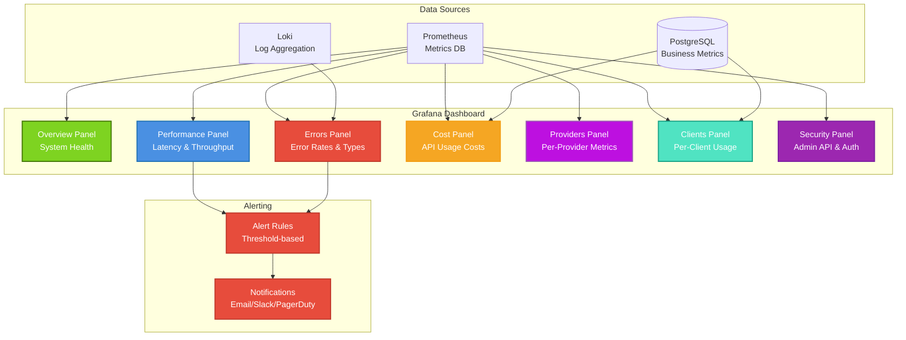

# Monitoring & Metrics

Guide to monitoring and tracking COO-LLM in production.

## Metrics Overview

COO-LLM collects detailed metrics about:
- **Request latency**: Request processing time
- **Token usage**: Number of tokens consumed per provider/key
- **Error rates**: Error rate per provider
- **Rate limiting**: Requests rejected due to rate limits
- **Client metrics**: Per-client usage, costs, and performance
- **Provider metrics**: Detailed provider-specific analytics
- **Global metrics**: System-wide aggregated statistics
- **Security events**: Admin API access, authentication attempts

## Client Management

### Monitoring Client Usage

Track API client behavior and usage patterns:

```bash
# Get client metrics via Admin API
curl -H "Authorization: Bearer admin-key" \
  http://localhost:2906/admin/v1/metrics/clients/client-123

# Response includes:
# - Total requests and tokens used
# - Cost breakdown by provider
# - Success rate and average latency
# - Last activity timestamp
```

### Client Health Dashboard

Monitor client health and detect anomalies:

- **Usage spikes**: Sudden increases in request volume
- **Error rate increases**: Client-specific error patterns
- **Cost overruns**: Budget monitoring per client
- **Provider distribution**: How clients use different providers

## Enhanced Metrics API

### Client-Specific Metrics

```bash
# Get detailed client metrics
GET /admin/v1/metrics/clients/{client_id}?start=1700000000&end=1700003600

# Response:
{
  "client_id": "client-123",
  "total_requests": 1000,
  "total_tokens": 50000,
  "total_cost": 25.50,
  "success_rate": 0.98,
  "avg_latency": 150.5,
  "last_request_time": 1700001000
}
```

### Provider Performance Metrics

```bash
# Get provider-specific analytics
GET /admin/v1/metrics/providers/openai?start=1700000000&end=1700003600

# Response:
{
  "provider_id": "openai",
  "total_requests": 500,
  "total_tokens": 25000,
  "total_cost": 12.50,
  "success_rate": 0.99,
  "avg_latency": 120.3,
  "error_count": 5
}
```

### Global System Metrics

```bash
# Get system-wide statistics
GET /admin/v1/metrics/global?start=1700000000&end=1700003600

# Response:
{
  "total_clients": 5,
  "total_providers": 3,
  "total_requests": 2500,
  "total_tokens": 125000,
  "total_cost": 62.50,
  "overall_success_rate": 0.97,
  "avg_latency": 135.2
}
```

## Security Monitoring

### Admin API Audit Logs

All admin operations are logged for security auditing:

```
[AUDIT] POST /admin/v1/clients from 192.168.1.100
[AUDIT] GET /admin/v1/metrics/global completed in 45ms
[AUDIT] DELETE /admin/v1/clients/client-123 from 10.0.0.50
```

### Rate Limiting Metrics

Monitor admin API usage and rate limit hits:

```promql
# Admin API request rate
rate(coo_llm_admin_requests_total[5m])

# Rate limit hits
rate(coo_llm_admin_rate_limits_total[5m])
```

### Authentication Monitoring

Track authentication attempts and failures:

- **Successful logins**: Web UI authentication
- **Failed attempts**: Invalid credentials, expired tokens
- **Rate limit hits**: Brute force protection
- **Token usage**: JWT token validation

## Prometheus Integration

### Prometheus Configuration

```yaml
# prometheus.yml
scrape_configs:
  - job_name: 'coo-llm'
    static_configs:
      - targets: ['localhost:2906']
    metrics_path: '/metrics'
```

### Metrics Available

| Metric | Type | Description |
|--------|------|-------------|
| `coo_llm_requests_total` | Counter | Total requests by provider, model, key |
| `coo_llm_tokens_total` | Counter | Total tokens used by provider, key |
| `coo_llm_cost_total` | Counter | Total API costs by provider, key |
| `coo_llm_latency_seconds` | Histogram | Request latency distribution |
| `coo_llm_errors_total` | Counter | Total errors by type, provider |
| `coo_llm_rate_limits_total` | Counter | Rate limit hits by key |
| `coo_llm_admin_requests_total` | Counter | Admin API requests by endpoint |
| `coo_llm_admin_rate_limits_total` | Counter | Admin API rate limit hits |
| `coo_llm_client_requests_total` | Counter | Requests by client ID |
| `coo_llm_client_tokens_total` | Counter | Token usage by client ID |
| `coo_llm_client_cost_total` | Counter | Cost by client ID |

### Query Examples

```promql
# Request rate per provider
rate(coo_llm_requests_total[5m])

# Error rate
rate(coo_llm_errors_total[5m]) / rate(coo_llm_requests_total[5m])

# P95 latency
histogram_quantile(0.95, rate(coo_llm_latency_seconds_bucket[5m]))

# Token usage per key
rate(coo_llm_tokens_total[1h])

# Cost tracking
sum(rate(coo_llm_cost_total[1h])) by (provider)

# Client usage patterns
topk(10, rate(coo_llm_client_requests_total[1h]))

# Admin API monitoring
rate(coo_llm_admin_requests_total[5m])
```

## Grafana Dashboards

### Dashboard Architecture



### Sample Dashboard JSON

```json
{
  "dashboard": {
    "title": "COO-LLM Production Dashboard",
    "panels": [
      {
        "title": "System Overview",
        "type": "stat",
        "targets": [{
          "expr": "up{job='coo-llm'}",
          "legendFormat": "Instances Up"
        }]
      },
      {
        "title": "Request Rate by Provider",
        "type": "bargauge",
        "targets": [{
          "expr": "rate(coo_llm_requests_total[5m])",
          "legendFormat": "{{provider}}"
        }]
      },
      {
        "title": "Error Rate Trend",
        "type": "graph",
        "targets": [{
          "expr": "rate(coo_llm_errors_total[5m]) / rate(coo_llm_requests_total[5m]) * 100",
          "legendFormat": "{{provider}} error %"
        }]
      },
      {
        "title": "Latency Distribution",
        "type": "heatmap",
        "targets": [{
          "expr": "rate(coo_llm_latency_seconds_bucket[5m])",
          "legendFormat": "{{le}}"
        }]
      },
      {
        "title": "Cost Tracking",
        "type": "table",
        "targets": [{
          "expr": "sum(rate(coo_llm_tokens_total[1h])) by (provider) * $TOKEN_COSTS",
          "legendFormat": "{{provider}}"
        }]
      }
    ]
  }
}
```

## Admin API Monitoring

### Get Current Metrics

```bash
curl -H "Authorization: Bearer your-admin-key" \
  http://localhost:2906/admin/v1/metrics?start=1700000000&end=1700003600
```

### Response Format

```json
{
  "latency": {
    "points": [
      {"timestamp": 1700000100, "value": 150.5},
      {"timestamp": 1700000200, "value": 120.2}
    ]
  },
  "tokens": {
    "points": [
      {"timestamp": 1700000100, "value": 1000},
      {"timestamp": 1700000200, "value": 1200}
    ]
  }
}
```

## Logging

### File Logging

COO-LLM logs to file with configuration:

```yaml
logging:
  file:
    enabled: true
    path: "/var/log/coo-llm/app.log"
    max_size_mb: 100
    max_backups: 5
```

### Log Levels

- **INFO**: Normal operations
- **WARN**: Non-critical issues
- **ERROR**: Failures requiring attention
- **DEBUG**: Detailed debugging (development only)

### Structured Logging

Logs include structured fields:
- `request_id`: Unique request identifier
- `provider`: LLM provider used
- `model`: Model name
- `latency_ms`: Response time
- `tokens_used`: Token count
- `client_key`: API key (hashed)

## Health Checks

### Basic Health Check

```bash
curl http://localhost:2906/health
# Response: {"status": "ok"}
```

### Detailed Health Check

```bash
curl -H "Authorization: Bearer admin-key" \
  http://localhost:2906/admin/v1/health
```

Checks:
- Database connectivity
- Provider API reachability
- Memory usage
- Goroutine count

## Alerting

### Recommended Alerts

```yaml
# Prometheus Alert Rules
groups:
  - name: coo-llm
    rules:
      - alert: HighErrorRate
        expr: rate(coo_llm_errors_total[5m]) / rate(coo_llm_requests_total[5m]) > 0.1
        for: 5m
        labels:
          severity: warning
        annotations:
          summary: "High error rate detected"

      - alert: HighLatency
        expr: histogram_quantile(0.95, rate(coo_llm_latency_seconds_bucket[5m])) > 10
        for: 5m
        labels:
          severity: warning
        annotations:
          summary: "High latency detected"
```

## Storage Backends

### InfluxDB for Time-Series Metrics

```yaml
storage:
  runtime:
    type: "influxdb"
    addr: "http://influxdb:8086"
    token: "${INFLUX_TOKEN}"
    org: "${INFLUX_ORG}"
    bucket: "${INFLUX_BUCKET}"
```

### Redis for Caching

```yaml
storage:
  runtime:
    type: "redis"
    addr: "localhost:6379"
    password: "${REDIS_PASSWORD}"
```

## Best Practices

1. **Monitor key metrics**: Request rate, error rate, latency
2. **Set up alerts**: For high error rates, latency spikes
3. **Use structured logging**: For easier parsing and analysis
4. **Implement health checks**: In load balancers
5. **Archive old metrics**: To control storage costs
6. **Monitor costs**: Track token usage per provider/key