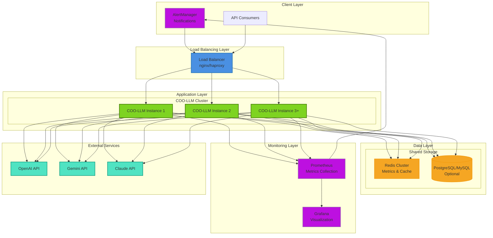
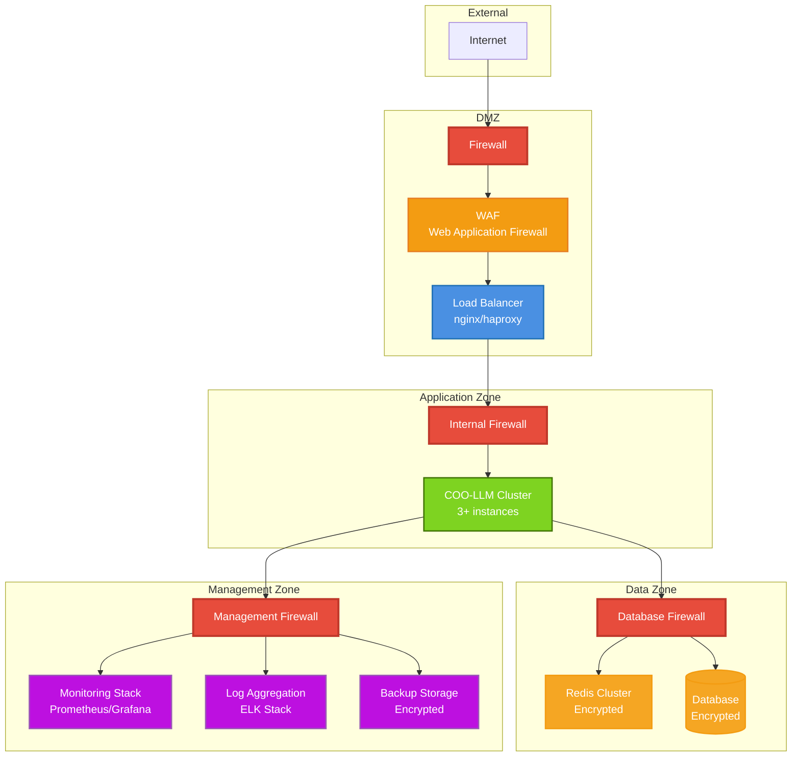

# Administrator Guide Overview

This guide provides comprehensive information for system administrators deploying and managing COO-LLM in production environments.

## 🎯 Administrator Responsibilities

As a COO-LLM administrator, you'll be responsible for:

- **System Deployment**: Installing and configuring COO-LLM for production
- **Performance Monitoring**: Tracking system health and performance metrics
- **Security Management**: Implementing security best practices and access controls
- **Troubleshooting**: Diagnosing and resolving system issues
- **Capacity Planning**: Scaling infrastructure based on usage patterns
- **Compliance**: Ensuring regulatory compliance and audit requirements

## 📋 Quick Start for Administrators

### 1. Production Deployment Checklist

```bash
# 1. Choose deployment method
docker-compose up -d  # or Kubernetes, or bare metal

# 2. Configure monitoring
curl http://localhost:2906/metrics  # Prometheus endpoint

# 3. Set up logging
tail -f /var/log/coo-llm/app.log

# 4. Configure security
# - Set strong admin password
# - Enable HTTPS
# - Configure firewall rules

# 5. Test system
curl http://localhost:2906/health
```

### 2. Essential Configuration

```yaml
version: "1.0"
server:
  listen: ":443"  # HTTPS in production
  admin_api_key: "${ADMIN_KEY}"  # Strong, unique key

storage:
  runtime:
    type: "redis"  # For production scalability
    addr: "redis:6379"

logging:
  level: "info"
  prometheus:
    enabled: true

# Security hardening
policy:
  retry:
    max_attempts: 3
  cache:
    enabled: true
```

## 🏗️ Production Architecture

### Color Scheme Legend

| Color | Component Type | Examples |
|-------|----------------|----------|
| 🔵 Blue | Load Balancing & Traffic | Load Balancers, Auto Scaling |
| 🟢 Green | Application & Core Services | COO-LLM instances, Health checks |
| 🟠 Orange | Data & Storage | Redis, Databases, Caching |
| 🟣 Purple | Monitoring & Management | Prometheus, Grafana, Alerting |
| 🔴 Red | Security & Critical | Firewalls, Alerts, Errors |
| 🟡 Teal | External Services | LLM APIs, Third-party services |

### Recommended Deployment Architecture



### Security Architecture



### High Availability Considerations

- **Multiple Instances**: Run 3+ COO-LLM instances behind load balancer
- **Shared Storage**: Redis cluster for metrics and caching
- **Health Checks**: Implement comprehensive health monitoring
- **Auto-scaling**: Scale based on CPU/memory or request rate
- **Backup Strategy**: Regular configuration and data backups

## 🔒 Security Best Practices

### Network Security

```bash
# Firewall configuration
ufw allow 443/tcp    # HTTPS only
ufw allow 22/tcp     # SSH for management
ufw --force enable

# SSL/TLS Configuration
server:
  listen: ":443"
  tls:
    cert_file: "/etc/ssl/coo-llm.crt"
    key_file: "/etc/ssl/coo-llm.key"
```

### Access Control

```yaml
# Admin API Security
server:
  admin_api_key: "${SECURE_ADMIN_KEY}"
  webui:
    admin_id: "admin"
    admin_password: "${SECURE_PASSWORD}"

# Client API Key Management
api_keys:
  - key: "${CLIENT_KEY_1}"
    allowed_providers: ["openai", "gemini"]
    limits:
      req_per_min: 100
      tokens_per_min: 50000
```

### Data Protection

- **API Key Encryption**: Store keys encrypted at rest
- **Audit Logging**: Log all admin actions and API access
- **Data Minimization**: Only collect necessary metrics
- **Regular Rotation**: Rotate API keys and certificates

## 📊 Monitoring Strategy

### Key Metrics to Monitor

| Metric Category | What to Monitor | Alert Threshold |
|-----------------|-----------------|-----------------|
| **Availability** | Service uptime | < 99.9% |
| **Performance** | P95 latency | > 5 seconds |
| **Errors** | Error rate | > 5% |
| **Resources** | CPU/Memory usage | > 80% |
| **Business** | Token consumption | Budget limits |

### Monitoring Stack Setup

```yaml
# docker-compose.yml for monitoring
version: '3.8'
services:
  prometheus:
    image: prom/prometheus
    volumes:
      - ./prometheus.yml:/etc/prometheus/prometheus.yml

  grafana:
    image: grafana/grafana
    environment:
      - GF_SECURITY_ADMIN_PASSWORD=${GRAFANA_PASSWORD}

  coo-llm:
    image: khapu2906/coo-llm:latest
    environment:
      - OPENAI_API_KEY=${OPENAI_API_KEY}
    ports:
      - "2906:2906"
```

## 🚨 Incident Response

### Alert Classification

- **🔴 Critical**: Service down, data loss
- **🟠 High**: High error rates, performance degradation
- **🟡 Medium**: Configuration issues, partial failures
- **🟢 Low**: Informational alerts

### Response Procedures

**For Critical Alerts:**
1. Assess impact and notify stakeholders
2. Check system health: `curl http://localhost:2906/health`
3. Review recent logs: `tail -f /var/log/coo-llm/app.log`
4. Check monitoring dashboards
5. Implement mitigation (restart, failover, rollback)
6. Post-mortem analysis

**For Performance Issues:**
1. Check resource usage: `top`, `free -h`
2. Review metrics: latency, error rates, throughput
3. Identify bottlenecks: provider APIs, storage, network
4. Scale resources or optimize configuration
5. Monitor improvement

## 📈 Capacity Planning

### Resource Sizing Guidelines

| Expected RPS | CPU Cores | Memory | Storage |
|---------------|-----------|--------|---------|
| < 10 | 1-2 | 512MB | 10GB |
| 10-100 | 2-4 | 1-2GB | 50GB |
| 100-1000 | 4-8 | 4-8GB | 200GB |
| > 1000 | 8+ | 16GB+ | 500GB+ |

### Scaling Strategies

**Horizontal Scaling:**
- Add more COO-LLM instances
- Use load balancer for distribution
- Shared Redis for state consistency

**Vertical Scaling:**
- Increase CPU/memory per instance
- Optimize configuration for performance
- Use faster storage backends

## 🔄 Backup & Recovery

### Configuration Backup

```bash
# Daily config backup
#!/bin/bash
DATE=$(date +%Y%m%d)
curl -H "Authorization: Bearer ${ADMIN_KEY}" \
  http://localhost:2906/admin/v1/config > config-${DATE}.yaml

# Encrypt and store
gpg -c config-${DATE}.yaml
aws s3 cp config-${DATE}.yaml.gpg s3://backups/coo-llm/
```

### Data Recovery

**Metrics Recovery:**
- Restore from backup storage
- Rebuild from logs if needed
- Validate data integrity

**Configuration Recovery:**
- Keep multiple config versions
- Test config before applying
- Document change history

## 📋 Maintenance Procedures

### Regular Tasks

**Daily:**
- Check system health and alerts
- Review error logs and metrics
- Monitor resource usage

**Weekly:**
- Update to latest COO-LLM version
- Rotate API keys if needed
- Review and optimize configuration

**Monthly:**
- Full system backup
- Performance analysis and tuning
- Security assessment

### Version Upgrades

```bash
# Zero-downtime upgrade process
# 1. Backup current config and data
# 2. Update one instance at a time
# 3. Verify health checks pass
# 4. Update load balancer weights
# 5. Remove old instances

docker pull khapu2906/coo-llm:latest
docker-compose up -d --scale coo-llm=3
```

## 🏢 Enterprise Integration

### SSO Integration

```yaml
# LDAP/Active Directory
auth:
  type: "ldap"
  server: "ldap.company.com"
  base_dn: "dc=company,dc=com"
  user_search_filter: "(sAMAccountName=%s)"
```

### Audit & Compliance

```yaml
logging:
  audit:
    enabled: true
    path: "/var/log/coo-llm/audit.log"
    format: "json"

compliance:
  gdpr: true
  soc2: true
  data_retention_days: 365
```

## 📚 Guide Sections

This administrator guide is organized into the following sections:

- **[Monitoring & Metrics](../Administrator-Guide/Monitoring.md)**: Comprehensive monitoring setup and metrics analysis
- **[Troubleshooting](../Administrator-Guide/Troubleshooting.md)**: Diagnosing and resolving common issues
- **[Web UI Administration](../Administrator-Guide/Web-UI.md)**: Managing COO-LLM through the web interface
- **[Security & Compliance](../Administrator-Guide/Security.md)**: Security best practices and compliance
- **[Performance Tuning](../Administrator-Guide/Performance.md)**: Optimizing for high-performance deployments

## 🆘 Getting Help

- **Documentation**: Check this guide and API references
- **GitHub Issues**: Search existing issues or create new ones
- **Community**: Join discussions for peer support
- **Professional Services**: Contact maintainers for enterprise support

## 🚀 Next Steps

1. **[Deploy COO-LLM](../Guides/Deployment.md)** in your environment
2. **[Configure Monitoring](../Administrator-Guide/Monitoring.md)** for observability
3. **[Set up Security](../Administrator-Guide/Security.md)** best practices
4. **[Plan Capacity](../Administrator-Guide/Performance.md)** for your workload
5. **Establish backup procedures** (covered in this guide)