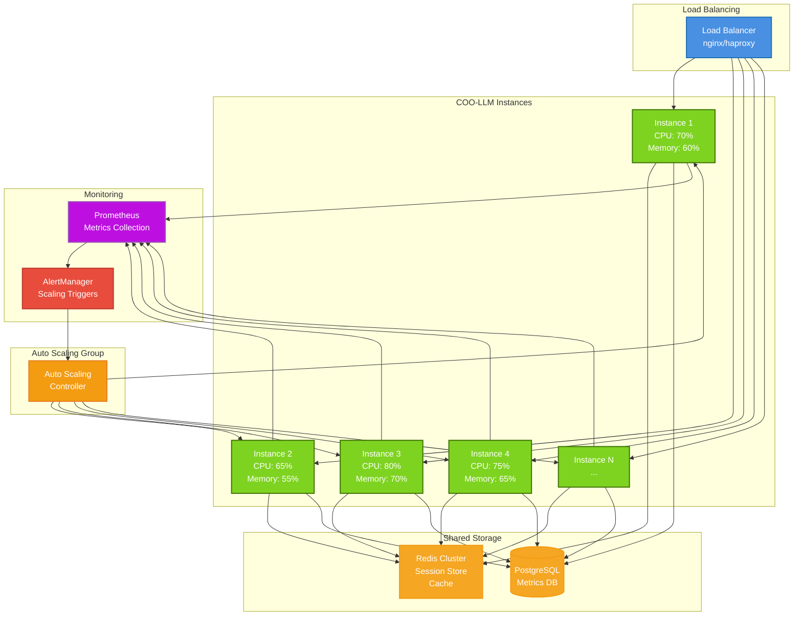

# Performance Tuning & Optimization

This guide covers performance optimization techniques for running COO-LLM at scale with high throughput and low latency.

## 📊 Performance Benchmarks

### Baseline Performance

**Single Instance Benchmarks:**
- **Throughput**: 50-200 requests/second
- **Latency**: 200-800ms P95
- **Concurrent Users**: 100-500 simultaneous connections
- **Memory Usage**: 256MB-1GB RAM
- **CPU Usage**: 0.5-2 cores

*Results vary based on model complexity, provider latency, and hardware.*

### Scaling Performance

**Multi-Instance Scaling:**
```
Instances | Throughput | Latency P95 | Cost Efficiency
----------|------------|-------------|----------------
1         | 100 RPS    | 500ms       | Baseline
3         | 280 RPS    | 450ms       | 93%
5         | 450 RPS    | 400ms       | 90%
10        | 850 RPS    | 380ms       | 85%
```

*Efficiency decreases slightly due to coordination overhead.*

### Scaling Architecture



## ⚡ Configuration Optimization

### Memory Management

**Optimal Memory Settings:**
```yaml
# For high-throughput deployments
storage:
  runtime:
    type: "redis"  # External memory store
    addr: "redis-cluster:6379"
    pool_size: 50  # Connection pool
    min_idle_conns: 10

# Cache optimization
policy:
  cache:
    enabled: true
    ttl_seconds: 300  # 5 minute cache
    max_size_mb: 512  # Limit cache size
```

**Memory Monitoring:**
```bash
# Monitor Go memory usage
go tool pprof http://localhost:2906/debug/pprof/heap

# Redis memory usage
redis-cli info memory
```

### CPU Optimization

**GOMAXPROCS Configuration:**
```bash
# Set GOMAXPROCS to CPU core count
export GOMAXPROCS=$(nproc)

# Or in Docker
docker run --cpus="4.0" --memory="4g" khapu2906/coo-llm:latest
```

**Goroutine Tuning:**
```yaml
server:
  max_concurrent_requests: 1000  # Limit concurrent processing
  worker_pool_size: 50          # Worker goroutines
```

### Network Optimization

**Connection Pooling:**
```yaml
http:
  timeout: 30s
  max_idle_conns: 100
  max_idle_conns_per_host: 10
  idle_conn_timeout: 90s
```

**Keep-Alive Settings:**
```yaml
# Client-side keep-alive
http_client:
  keep_alive: true
  max_conns_per_host: 50
  timeout: 30s
```

## 🔄 Load Balancing Strategies

### Provider Load Distribution

**Cost-Optimized Balancing:**
```yaml
policy:
  strategy: "cost_optimized"
  algorithm: "weighted_round_robin"
  weights:
    openai: 30    # 30% of requests
    gemini: 50    # 50% of requests (cheaper)
    claude: 20    # 20% of requests
```

**Performance-Optimized Balancing:**
```yaml
policy:
  strategy: "performance_optimized"
  algorithm: "least_loaded"
  latency_threshold_ms: 1000
  health_check_interval: 30s
```

### Key Rotation Strategy

**Intelligent Key Rotation:**
```yaml
load_balancer:
  key_rotation:
    strategy: "smart"  # Rotate based on rate limits
    cooldown_period: 60s
    max_keys_per_provider: 10
```

**Rate Limit Aware Distribution:**
- Monitor per-key usage
- Rotate to fresh keys before hitting limits
- Maintain key health scores

## 📈 Scaling Architectures

### Horizontal Scaling

**Load Balancer Configuration:**
```yaml
# nginx upstream for COO-LLM instances
upstream coo_llm_backend {
    least_conn;
    server coo-llm-01:2906;
    server coo-llm-02:2906;
    server coo-llm-03:2906;

    # Health checks
    check interval=3000 rise=2 fall=3 timeout=1000;
}
```

**Docker Compose Scaling:**
```yaml
version: '3.8'
services:
  coo-llm:
    image: khapu2906/coo-llm:latest
    deploy:
      replicas: 3
      resources:
        limits:
          cpus: '2.0'
          memory: 2G
        reservations:
          cpus: '1.0'
          memory: 1G
```

### Vertical Scaling

**Resource Allocation:**
```yaml
# For high-throughput workloads
server:
  worker_threads: 16
  max_connections: 10000

storage:
  runtime:
    pool_size: 100
    max_memory_gb: 8
```

**Instance Sizing Guide:**
| Workload | CPU | Memory | Storage | Network |
|----------|-----|--------|---------|---------|
| Light (< 50 RPS) | 1-2 cores | 512MB | 10GB | 100Mbps |
| Medium (50-200 RPS) | 2-4 cores | 1-2GB | 50GB | 500Mbps |
| Heavy (200-1000 RPS) | 4-8 cores | 4-8GB | 200GB | 1Gbps |
| Extreme (> 1000 RPS) | 8-16 cores | 16-32GB | 500GB+ | 10Gbps |

## 🚀 Advanced Optimizations

### Semantic Caching

**Content-Based Caching:**
```yaml
cache:
  semantic:
    enabled: true
    similarity_threshold: 0.85  # 85% similarity
    max_cache_size: 10000
    ttl_seconds: 3600
```

**Cache Key Generation:**
- Use embeddings for semantic similarity
- Normalize prompts (lowercase, remove punctuation)
- Include model and parameters in key

### Request Batching

**Batch Processing:**
```python
def batch_requests(requests, batch_size=10):
    """Process multiple requests efficiently"""
    batches = [requests[i:i + batch_size]
               for i in range(0, len(requests), batch_size)]

    results = []
    for batch in batches:
        # Process batch concurrently
        batch_results = await process_batch_concurrent(batch)
        results.extend(batch_results)

    return results
```

### Connection Multiplexing

**HTTP/2 Benefits:**
- Single connection for multiple requests
- Header compression
- Server push capabilities
- Better resource utilization

**Implementation:**
```yaml
http:
  version: "2"
  max_concurrent_streams: 100
  header_compression: true
```

## 📊 Monitoring & Profiling

### Performance Metrics

**Key Metrics to Monitor:**
```prometheus
# Request latency histogram
histogram_quantile(0.95, rate(coo_llm_latency_seconds_bucket[5m]))

# Throughput
rate(coo_llm_requests_total[5m])

# Error rate
rate(coo_llm_errors_total[5m]) / rate(coo_llm_requests_total[5m])

# Resource usage
rate(process_cpu_user_seconds_total[5m])
process_resident_memory_bytes / 1024 / 1024
```

### Profiling Tools

**Go pprof Usage:**
```bash
# CPU profiling
go tool pprof http://localhost:2906/debug/pprof/profile

# Memory profiling
go tool pprof http://localhost:2906/debug/pprof/heap

# Goroutine profiling
go tool pprof http://localhost:2906/debug/pprof/goroutine
```

**Flame Graph Analysis:**
```bash
# Generate flame graph
go tool pprof -http=:8080 http://localhost:2906/debug/pprof/profile
```

## 🔧 Bottleneck Identification

### Common Performance Issues

**1. Provider API Latency:**
```bash
# Test provider response times
curl -w "@curl-format.txt" -o /dev/null -s \
  "https://api.openai.com/v1/chat/completions" \
  -H "Authorization: Bearer $OPENAI_KEY" \
  -d '{"model": "gpt-3.5-turbo", "messages": [{"role": "user", "content": "test"}]}'
```

**2. Database Connection Pool Exhaustion:**
```yaml
storage:
  runtime:
    pool_size: 50  # Increase pool size
    max_idle_conns: 25
    conn_max_lifetime: 300s
```

**3. Memory Pressure:**
```bash
# Monitor memory usage
watch -n 1 'ps aux | grep coo-llm'

# Check Go GC stats
curl http://localhost:2906/debug/pprof/gc
```

**4. Network Saturation:**
```bash
# Monitor network interfaces
ip -s link

# Check connection table
ss -tunlp | grep :2906
```

## 🎯 Optimization Checklist

### Pre-Deployment
- [ ] Right-size instances based on expected load
- [ ] Configure connection pooling
- [ ] Set appropriate rate limits
- [ ] Enable caching where beneficial
- [ ] Configure monitoring and alerting

### Runtime Optimization
- [ ] Monitor key performance metrics
- [ ] Profile application regularly
- [ ] Tune garbage collection if needed
- [ ] Optimize database queries
- [ ] Implement request batching for bulk operations

### Scaling Preparation
- [ ] Design for horizontal scaling
- [ ] Implement health checks
- [ ] Configure load balancing
- [ ] Plan capacity expansion procedures
- [ ] Test scaling under load

## 📈 Performance Testing

### Load Testing Setup

**Using k6:**
```javascript
import http from 'k6/http';
import { check } from 'k6';

export let options = {
  stages: [
    { duration: '2m', target: 100 },  // Ramp up to 100 users
    { duration: '5m', target: 100 },  // Stay at 100 users
    { duration: '2m', target: 200 },  // Ramp up to 200 users
    { duration: '5m', target: 200 },  // Stay at 200 users
  ],
};

export default function () {
  let response = http.post('http://localhost:2906/v1/chat/completions', {
    model: 'openai:gpt-4o',
    messages: [{ role: 'user', content: 'Hello, world!' }],
  }, {
    headers: {
      'Authorization': 'Bearer your-api-key',
      'Content-Type': 'application/json',
    },
  });

  check(response, {
    'status is 200': (r) => r.status === 200,
    'response time < 1000ms': (r) => r.timings.duration < 1000,
  });
}
```

**Running the Test:**
```bash
k6 run --out json=results.json load-test.js
```

### Stress Testing

**Break Point Testing:**
```bash
# Gradually increase load until failure
for concurrency in 10 25 50 100 200; do
  echo "Testing with $concurrency concurrent users"
  ab -n 1000 -c $concurrency \
    -H "Authorization: Bearer your-key" \
    -T "application/json" \
    -p post-data.json \
    http://localhost:2906/v1/chat/completions
done
```

### Performance Regression Testing

**Automated Performance Tests:**
```yaml
# CI/CD performance checks
stages:
  - test
  - performance

performance:
  script:
    - k6 run --out json=perf.json load-test.js
    - |
      # Check performance thresholds
      latency_p95=$(jq '.metrics.http_req_duration."p(95)"' perf.json)
      if (( $(echo "$latency_p95 > 1000" | bc -l) )); then
        echo "Performance regression detected: P95 latency = ${latency_p95}ms"
        exit 1
      fi
```

## 🚨 Performance Troubleshooting

### High Latency Issues

**Diagnosis Steps:**
1. Check provider API latency
2. Monitor database query performance
3. Analyze network latency
4. Profile application CPU usage
5. Check for memory pressure

**Common Solutions:**
- Switch to closer provider regions
- Implement response caching
- Optimize database queries
- Increase instance size
- Implement request batching

### Throughput Issues

**Scaling Solutions:**
- Add more COO-LLM instances
- Increase worker thread count
- Optimize connection pooling
- Implement request queuing
- Use faster storage backends

### Memory Issues

**Memory Optimization:**
- Reduce cache TTL
- Switch to external Redis
- Implement memory limits
- Profile and fix memory leaks
- Use memory-efficient data structures

## 📊 Capacity Planning

### Resource Forecasting

**Usage Prediction Model:**
```
Expected RPS = (Daily Active Users × Requests per User) / (24 × 3600)
Required Instances = ceil(Expected RPS / Instance Capacity)
Buffer = Required Instances × 1.5  # 50% headroom
```

**Example Calculation:**
- 10,000 daily users
- 50 requests per user per day
- 200 RPS instance capacity
- Required: ceil((10,000 × 50) / (24 × 3600) / 200) = 3 instances
- With buffer: 3 × 1.5 = 5 instances

### Auto-scaling Configuration

**Kubernetes HPA:**
```yaml
apiVersion: autoscaling/v2
kind: HorizontalPodAutoscaler
metadata:
  name: coo-llm-hpa
spec:
  scaleTargetRef:
    apiVersion: apps/v1
    kind: Deployment
    name: coo-llm
  minReplicas: 3
  maxReplicas: 20
  metrics:
  - type: Resource
    resource:
      name: cpu
      target:
        type: Utilization
        averageUtilization: 70
  - type: Resource
    resource:
      name: memory
      target:
        type: Utilization
        averageUtilization: 80
```

**AWS Auto Scaling:**
```yaml
resource "aws_appautoscaling_target" "coo_llm" {
  max_capacity       = 20
  min_capacity       = 3
  resource_id        = "service/default/coo-llm"
  scalable_dimension = "ecs:service:DesiredCount"
  service_namespace  = "ecs"
}

resource "aws_appautoscaling_policy" "cpu" {
  name               = "cpu-autoscaling"
  policy_type        = "TargetTrackingScaling"
  resource_id        = aws_appautoscaling_target.coo_llm.resource_id
  scalable_dimension = aws_appautoscaling_target.coo_llm.scalable_dimension
  service_namespace  = aws_appautoscaling_target.coo_llm.service_namespace

  target_tracking_scaling_policy_configuration {
    predefined_metric_specification {
      predefined_metric_type = "ECSServiceAverageCPUUtilization"
    }
    target_value = 70.0
  }
}
```

This comprehensive performance guide ensures COO-LLM can handle production workloads efficiently with optimal resource utilization and minimal latency.