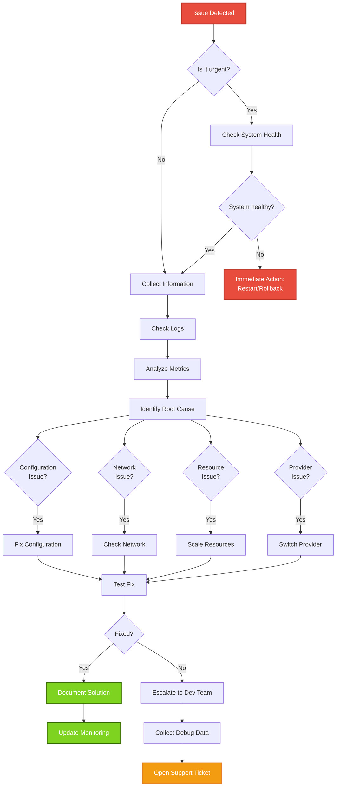

# Troubleshooting

Guide to troubleshooting common issues with COO-LLM.

## Startup Issues

### Server Won't Start

**Symptoms:**
- Server exits immediately
- Error: "Failed to load config"

**Solutions:**
1. Check config file path: `coo-llm --config /path/to/config.yaml`
2. Validate YAML syntax: `yamllint config.yaml`
3. Check required fields: `admin_api_key`, `llm_providers`
4. Verify environment variables: `echo $OPENAI_API_KEY`

### Port Already in Use

**Symptoms:**
- Error: "listen tcp :2906: bind: address already in use"

**Solutions:**
1. Change port in config: `server.listen: ":2907"`
2. Find process using port: `lsof -i :2906`
3. Kill conflicting process: `kill -9 <PID>`

### Provider API keys invalid

**Symptoms:**
- Startup succeeds but all requests fail
- Logs show "invalid api key"

**Solutions:**
1. Verify API keys in environment: `echo $OPENAI_API_KEY | head -c 10`
2. Test keys manually with provider API
3. Check key format (some providers require "sk-" prefix)

## Runtime Issues

### High Latency

**Symptoms:**
- Requests take >5 seconds
- Metrics show high P95 latency

**Causes & Solutions:**
1. **Provider API slow**: Switch to different provider or region
2. **Rate limiting**: Check `limits.req_per_min`, increase if needed
3. **Network issues**: Test connectivity to provider APIs
4. **Storage slow**: Switch from file to Redis for runtime storage

### Rate Limit Errors

**Symptoms:**
- HTTP 429 responses
- "rate limit exceeded" in logs

**Solutions:**
1. **Increase limits**: Update `limits.req_per_min` in config
2. **Add more keys**: Multiple API keys per provider for load balancing
3. **Implement backoff**: In client code, exponential backoff on 429
4. **Monitor usage**: Check admin API for per-key usage stats

### Authentication Failures

**Symptoms:**
- HTTP 401/403 responses
- "unauthorized" or "forbidden" errors

**Common Issues:**
1. **Wrong API key**: Verify key in `Authorization: Bearer <key>`
2. **Key not in config**: Check `api_keys` section
3. **Provider restrictions**: Ensure key allows requested provider
4. **Key expired**: Some providers rotate keys periodically

### Provider Errors

**Symptoms:**
- HTTP 500 responses
- "provider error" in logs

**Troubleshooting Steps:**
1. Check provider status: Visit provider's status page
2. Test provider API directly: Use curl with same key
3. Switch providers: Update model to use different provider
4. Check quotas: Some providers have daily/monthly limits

## Configuration Issues

### Model Not Found

**Symptoms:**
- "model not found" error

**Solutions:**
1. Use full syntax: `openai:gpt-4o` instead of `gpt-4o`
2. Check provider config: Ensure model exists in `llm_providers`
3. Verify spelling: Case-sensitive model names

### Invalid Configuration

**Symptoms:**
- Server fails to start with validation errors

**Common Validation Errors:**
1. **Missing required fields**: `admin_api_key`, provider `api_keys`
2. **Invalid URLs**: Check `base_url` format
3. **Type mismatches**: Ensure numbers are numeric, not strings
4. **Duplicate IDs**: Provider and key IDs must be unique

## Performance Issues

### Memory Usage High

**Symptoms:**
- Server consumes excessive RAM
- OOM kills in containers

**Solutions:**
1. **Switch storage**: Use Redis instead of SQL for large deployments
2. **Reduce cache TTL**: Lower `cache.ttl_seconds`
3. **Monitor goroutines**: Check for leaks with pprof
4. **Limit concurrent requests**: Use reverse proxy limits

### Storage Issues

**Symptoms:**
- "connection refused" to storage backend
- Slow response times

**Solutions:**
1. **Redis connection**: Verify `addr` and `password`
2. **InfluxDB setup**: Check URL, token, org, bucket
3. **File permissions**: Ensure write access to `./data/`
4. **Network connectivity**: Test connection to storage service

## Web UI Issues

### UI Not Loading

**Symptoms:**
- 404 on `http://localhost:2906/`
- Blank page or "not found"

**Solutions:**
1. **Build missing**: Run `npm run build` in `webui/` directory
2. **Wrong path**: Check `web_ui_path` in config
3. **CORS issues**: Ensure requests from correct origin
4. **Admin credentials**: Default is admin/password

### Custom UI Not Working

**Symptoms:**
- Custom UI path specified but not loading

**Solutions:**
1. **Path exists**: `ls -la /path/to/custom/ui/`
2. **Build artifacts**: Ensure `index.html` and assets exist
3. **Permissions**: Web server must read the files
4. **SPA routing**: Custom UI must handle client-side routing

## Logging & Debugging

### Enable Debug Logging

```yaml
logging:
  level: "debug"
  file:
    enabled: true
    path: "./debug.log"
```

### Common Debug Steps

1. **Check logs**: `tail -f /var/log/coo-llm/app.log`
2. **Enable pprof**: Access `http://localhost:2906/debug/pprof/`
3. **Test connectivity**: `curl -v http://provider-api.com`
4. **Validate config**: `coo-llm --config config.yaml --validate`

### Useful Commands

```bash
# Check open files/connections
lsof -p $(pgrep coo-llm)

# Monitor system resources
top -p $(pgrep coo-llm)

# Test API manually
curl -v -H "Authorization: Bearer test-key" \
  http://localhost:2906/v1/chat/completions \
  -d '{"model": "openai:gpt-4o", "messages": [{"role": "user", "content": "test"}]}'
```

## Troubleshooting Workflow



## Getting Help

If issues persist:

1. **Check GitHub Issues**: Search for similar problems
2. **Collect diagnostics**:
   - Config file (redact secrets)
   - Log files
   - System info: `uname -a`, `go version`
3. **Open new issue**: Include full error logs and reproduction steps

## Prevention

- **Monitor regularly**: Set up alerts for error rates >5%
- **Test deployments**: Use staging environment before production
- **Keep updated**: Monitor releases for bug fixes
- **Backup configs**: Version control configuration files