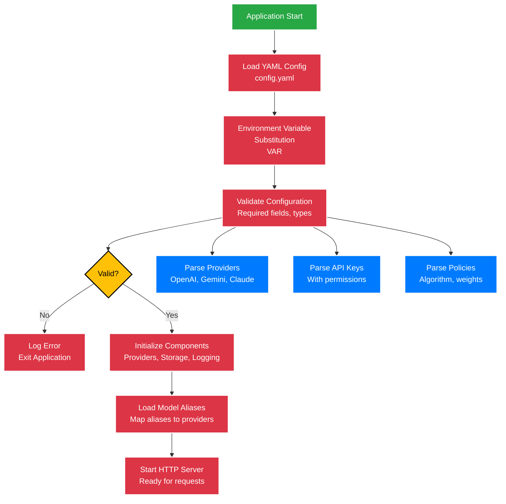

# Configuration

COO-LLM uses YAML configuration files for all settings. The configuration is hierarchical and supports environment variable substitution, validation, and hot-reload.

## Configuration Loading Flow



## Configuration File Structure

```yaml
version: "1.0"

server:
  listen: ":2906"
  admin_api_key: "${ADMIN_API_KEY}"
  cors:
    enabled: true
    allowed_origins: ["*"]
    allowed_methods: ["GET", "POST", "PUT", "DELETE", "OPTIONS"]
    allowed_headers: ["*"]
    allow_credentials: true
    max_age: 86400
  webui:
    enabled: true
    admin_id: "admin"
    admin_password: "password"
    # web_ui_path: "/path/to/custom/ui"  # Optional: custom web UI path

logging:
  file:
    enabled: true
    path: "./logs/llm.log"
    max_size_mb: 100
    max_backups: 5
  prometheus:
    enabled: true
    endpoint: "/metrics"
  providers: []

storage:
  config:
    type: "file"
    path: "./data/config.json"
  runtime:
    type: "sql"
    addr: "./data/coo-llm.db" 

llm_providers:
  - id: "openai"
    type: "openai"
    api_keys: ["${OPENAI_API_KEY}"]
    model: "gpt-4o"
    pricing:
      input_token_cost: 0.002
      output_token_cost: 0.01
    limits:
      req_per_min: 200
      tokens_per_min: 100000
  - id: "gemini"
    type: "gemini"
    api_keys: ["${GEMINI_API_KEY}"]
    model: "gemini-1.5-pro"
    pricing:
      input_token_cost: 0.00025
      output_token_cost: 0.0005
    limits:
      req_per_min: 150
      tokens_per_min: 80000
  - id: "claude"
    type: "claude"
    api_keys: ["${CLAUDE_API_KEY}"]
    base_url: "https://api.anthropic.com"
    model: "claude-3-opus-20240229"
    pricing:
      input_token_cost: 0.015
      output_token_cost: 0.075
    limits:
      req_per_min: 100
      tokens_per_min: 60000

api_keys:
  - id: "default-client"  # Optional unique identifier
    key: "${API_KEY}"
    allowed_providers: ["*"]  # Access all providers
    description: "Default API key for all providers"

model_aliases: {  # Use inline format to avoid YAML parsing issues with colon characters
  "gpt-4o": "openai:gpt-4o",
  "gpt-4o-mini": "openai:gpt-4o-mini",
  "gpt-4-turbo": "openai:gpt-4-turbo",
  "gpt-4": "openai:gpt-4",
  "gpt-3.5-turbo": "openai:gpt-3.5-turbo",
  "gpt-3.5-turbo-instruct": "openai:gpt-3.5-turbo-instruct",
  "gemini-1.5-pro": "gemini:gemini-1.5-pro",
  "gemini-2.0-pro": "gemini:gemini-2.0-pro",
  "gemini-2.0-flash": "gemini:gemini-2.0-flash",
  "gemini-2.5-pro": "gemini:gemini-2.5-pro",
  "gemini-2.5-flash": "gemini:gemini-2.5-flash",
  "claude-3-opus": "claude:claude-3-opus-20240229",
  "claude-3-sonnet": "claude:claude-3-sonnet-20240229",
  "claude-3-haiku": "claude:claude-3-haiku-20240307",
  "claude-3-5-sonnet": "claude:claude-3-5-sonnet-20240620",
  "opus-4.1": "claude:opus-4.1",
  "sonnet-4.5": "claude:sonnet-4.5",
  "haiku-3.5": "claude:haiku-3.5"
}

policy:
  strategy: "hybrid"
  algorithm: "hybrid"   # "round_robin", "least_loaded", "hybrid"
  priority: "balanced"  # "balanced", "cost", "req", "token" (auto-sets weights)
  hybrid_weights:       # Auto-set based on priority, or customize
    token_ratio: 0.2
    req_ratio: 0.2
    error_score: 0.2
    latency: 0.2
    cost_ratio: 0.2
  retry:
    max_attempts: 3      # Max retry attempts
    timeout: "30s"       # Timeout per attempt
    interval: "1s"       # Interval between retries
  fallback:
    enabled: true
    max_providers: 2
    providers: ["openai", "gemini"]
  cache:
    enabled: true        # Enable response caching
    ttl_seconds: 10      # Cache TTL (10 seconds)
```

## Configuration Sections

### Server Configuration

| Field | Type | Default | Description |
|-------|------|---------|-------------|
| `listen` | string | `:2906` | Server listen address |
| `admin_api_key` | string | - | API key for admin endpoints |
| `cors.enabled` | bool | `true` | Enable CORS support |
| `cors.allowed_origins` | []string | `["*"]` | Allowed origins or `["*"]` for all |
| `cors.allowed_methods` | []string | `["GET", "POST", "PUT", "DELETE", "OPTIONS"]` | Allowed HTTP methods |
| `cors.allowed_headers` | []string | `["*"]` | Allowed headers or `["*"]` for all |
| `cors.allow_credentials` | bool | `true` | Allow credentials in CORS requests |
| `cors.max_age` | int | `86400` | Preflight cache duration in seconds |

#### Web UI Configuration

| Field | Type | Default | Description |
|-------|------|---------|-------------|
| `enabled` | bool | `true` | Enable web UI |
| `admin_id` | string | `admin` | Admin login username |
| `admin_password` | string | `password` | Admin login password |
| `web_ui_path` | string | - | Custom path to web UI build directory (optional) |

### Logging Configuration

#### File Logging
| Field | Type | Default | Description |
|-------|------|---------|-------------|
| `enabled` | bool | `true` | Enable file logging |
| `path` | string | `./logs/llm.log` | Log file path |
| `max_size_mb` | int | `100` | Max file size in MB |
| `max_backups` | int | `5` | Max backup files |

#### Prometheus Logging
| Field | Type | Default | Description |
|-------|------|---------|-------------|
| `enabled` | bool | `true` | Enable Prometheus metrics |
| `endpoint` | string | `/metrics` | Metrics endpoint path |

#### Log Providers
Array of log provider configurations:

| Field | Type | Description |
|-------|------|-------------|
| `name` | string | Provider name |
| `type` | string | Provider type (`http`, `prometheus`, etc.) |
| `endpoint` | string | HTTP endpoint for webhooks |
| `batch.enabled` | bool | Enable batching |
| `batch.size` | int | Batch size |
| `batch.interval_seconds` | int | Batch interval |

### Storage Configuration

#### Config Storage
Used for dynamic config loading/saving with automatic masking of sensitive data.

| Field | Type | Default | Description |
|-------|------|---------|-------------|
| `type` | string | `file` | Storage type (`file`, `http`) |
| `path` | string | `./data/config.json` | File path (for file type) |

#### Runtime Storage
Used for caching, sessions, and runtime data.

| Field | Type | Default | Description |
|-------|------|---------|-------------|
| `type` | string | `sql` | Storage type (`redis`, `http`, `sql`, `mongodb`, `dynamodb`, `influxdb`) |
| `addr` | string | `./data/coo-llm.db` | Connection string, file path, or endpoint |
| `password` | string | - | Redis password or InfluxDB token |
| `api_key` | string | - | API key for HTTP storage or InfluxDB org |
| `database` | string | - | Database name for MongoDB or InfluxDB bucket |

**Storage Types:**
- `redis`: Redis database (persistent, distributed)
- `sql`: SQL database (SQLite/PostgreSQL, persistent)
- `mongodb`: MongoDB document database (persistent)
- `dynamodb`: AWS DynamoDB (persistent, serverless)
- `influxdb`: InfluxDB time-series database (historical metrics, persistent)
- `http`: HTTP endpoint storage (remote API)

### LLM Provider Configuration

> **Note:** The `providers` field is a legacy field and should not be used. Please use `llm_providers` instead.

Array of LLM provider configurations:

| Field | Type | Description |
|-------|------|-------------|
| `id` | string | Unique provider ID (used in model aliases) |
| `type` | string | Provider type: `openai`, `gemini`, `claude`, `custom` |
| `api_keys` | []string | Array of API keys for load balancing and failover |
| `base_url` | string | Provider API base URL (optional, uses default if not set) |
| `model` | string | Default model for this provider |
| `pricing.input_token_cost` | float64 | Cost per input token |
| `pricing.output_token_cost` | float64 | Cost per output token |
| `limits.req_per_min` | int | Request rate limit per key |
| `limits.tokens_per_min` | int | Token rate limit per key |

#### Multiple API Keys

Providers support multiple API keys for load balancing and redundancy:

```yaml
llm_providers:
  - id: "openai"
    type: "openai"
    api_keys: ["${OPENAI_KEY_1}", "${OPENAI_KEY_2}", "${OPENAI_KEY_3}"]
    model: "gpt-4o"
    limits:
      req_per_min: 200  # Per key
      tokens_per_min: 100000
```

**Key Selection Algorithm:**
- **Load Balancing**: Selects key with least usage (requests + tokens)
- **Failover**: Retries with next key on API errors (rate limits, quota)
- **Thread-Safe**: Concurrent requests use different keys safely

**Usage Tracking:**
- Tracks requests and tokens per key
- Balances load across keys automatically
- Resets on application restart

### API Key Permissions

Array of client API key configurations:

| Field | Type | Description |
|-------|------|-------------|
| `id` | string | Optional unique identifier for the API key |
| `key` | string | Client API key for authentication |
| `allowed_providers` | []string | Array of allowed provider IDs or `["*"]` for all |
| `description` | string | Human-readable description |

### Model Aliases

Model aliases map short names to provider:model combinations for convenience:

```yaml
model_aliases: {
  "gpt-4o": "openai:gpt-4o",
  "claude": "claude:claude-3-opus-20240229"
}
```

You can also use provider:model names directly:

```bash
# Examples
"gpt-4o"           # Uses alias
"openai:gpt-4o"    # Direct provider:model
"gemini:gemini-1.5-pro"
```

### Policy Configuration

Load balancing and routing policy:

| Field | Type | Default | Description |
|-------|------|---------|-------------|
| `strategy` | string | `hybrid` | Legacy field, use `algorithm` |
| `algorithm` | string | `round_robin` | Algorithm: `round_robin`, `least_loaded`, `hybrid` |
| `priority` | string | `balanced` | Priority preset: `balanced`, `cost`, `req`, `token` |
| `hybrid_weights.*` | float64 | - | Manual weights for hybrid scoring (0.0-1.0) |
| `retry.max_attempts` | int | `3` | Maximum retry attempts on failure |
| `retry.timeout` | duration | `30s` | Timeout per attempt |
| `retry.interval` | duration | `1s` | Delay between retries |
| `fallback.enabled` | bool | `true` | Enable fallback to other providers |
| `fallback.max_providers` | int | `2` | Max fallback providers to try |
| `fallback.providers` | []string | - | List of fallback provider IDs |
| `cache.enabled` | bool | `true` | Enable response caching |
| `cache.ttl_seconds` | int64 | `10` | Cache TTL in seconds |

### Model Names

Use full provider:model names directly (no aliases needed):

```bash
# Examples
"openai:gpt-4o"
"gemini:gemini-2.5-flash"
"claude:claude-3-opus"
"grok:grok-beta"
```

**Note:** Model aliases use inline YAML format to avoid parsing issues with colon characters. You can also use provider:model format directly.

### Policy Configuration

Load balancing and routing policy:

| Field | Type | Default | Description |
|-------|------|---------|-------------|
| `strategy` | string | `hybrid` | Legacy field, use `algorithm` |
| `algorithm` | string | `round_robin` | Algorithm: `round_robin`, `least_loaded`, `hybrid` |
| `priority` | string | `balanced` | Priority preset: `balanced`, `cost`, `req`, `token` (auto-sets weights) |
| `hybrid_weights.*` | float64 | - | Manual weights for hybrid scoring (0.0-1.0) |
| `retry.max_attempts` | int | `3` | Maximum retry attempts on failure |
| `retry.timeout` | duration | `30s` | Timeout per attempt |
| `retry.interval` | duration | `1s` | Delay between retries |
| `cache.enabled` | bool | `true` | Enable response caching |
| `cache.ttl_seconds` | int64 | `10` | Cache TTL in seconds |

#### Load Balancing Algorithms

- **round_robin**: Cycle through providers/keys sequentially
- **least_loaded**: Select provider/key with lowest current load
- **hybrid**: Weighted scoring based on cost, latency, error rate

#### API Key Load Balancing

Within each provider, multiple API keys are load balanced:
- Automatic failover on rate limits/quota errors
- Usage-based selection (requests + tokens)
- Thread-safe concurrent access

## Environment Variables

Configuration supports environment variable substitution in YAML files:

```yaml
server:
  admin_api_key: "${ADMIN_API_KEY}"

llm_providers:
  - api_keys: ["${OPENAI_KEY_1}", "${OPENAI_KEY_2}"]
    model: "${DEFAULT_MODEL}"
```

Set environment variables before running:

```bash
export OPENAI_KEY_1="sk-key1"
export OPENAI_KEY_2="sk-key2"
export DEFAULT_MODEL="gpt-4o"
./coo-llm --config config.yaml
```

**Note**: Variables are expanded at config load time, not runtime.

## Configuration Validation

COO-LLM validates configuration on startup:

- Required fields presence
- URL format validation
- Numeric range checks
- Provider and key uniqueness

Invalid configurations will prevent startup with detailed error messages.

## Hot Reload

Configuration can be reloaded without restarting:

```bash
curl -X POST http://localhost:2906/admin/v1/reload \
  -H "Authorization: Bearer your-admin-key"
```

## Example Configurations

### Minimal Configuration

```yaml
version: "1.0"
server:
  listen: ":2906"

llm_providers:
  - id: "openai"
    type: "openai"
    api_keys: ["sk-your-key"]
    model: "gpt-4o"

# model_aliases supported - maps short names to provider:model combinations
```

### Production Configuration

```yaml
version: "1.0"
server:
  listen: ":2906"
  admin_api_key: "${ADMIN_KEY}"

logging:
  file:
    enabled: true
    path: "/var/log/coo-llm/llm.log"
  prometheus:
    enabled: true

storage:
  config:
    type: "file"
    path: "./data/config.json"
  runtime:
    type: "influxdb"
    addr: "http://influxdb:8086"
    password: "${INFLUX_TOKEN}"
    api_key: "${INFLUX_ORG}"
    database: "${INFLUX_BUCKET}"

llm_providers:
  - id: "openai-prod"
    type: "openai"
    api_keys: ["${OPENAI_KEY_1}", "${OPENAI_KEY_2}", "${OPENAI_KEY_3}"]  # Multiple keys for load balancing
    base_url: "https://api.openai.com"
    model: "gpt-4o"
    pricing:
      input_token_cost: 0.002
      output_token_cost: 0.01
    limits:
      req_per_min: 200  # Per key rate limit
      tokens_per_min: 100000
  - id: "gemini-prod"
    type: "gemini"
    api_keys: ["${GEMINI_KEY_1}"]
    base_url: "https://generativelanguage.googleapis.com"
    model: "gemini-1.5-pro"
    pricing:
      input_token_cost: 0.00025
      output_token_cost: 0.0005
    limits:
      req_per_min: 150
      tokens_per_min: 80000

api_keys:
  - id: "client-a"
    key: "client-a-key"
    allowed_providers: ["openai-prod"]
    description: "Client A - OpenAI only"
  - id: "premium-client"
    key: "premium-key"
    allowed_providers: ["openai-prod", "gemini-prod"]
    description: "Premium client with all providers"

# model_aliases supported - or use "openai-prod:gpt-4o" or "gemini-prod:gemini-1.5-pro" directly

policy:
  algorithm: "hybrid"
  priority: "balanced"
  retry:
    max_attempts: 3
    timeout: "30s"
  cache:
    enabled: true
    ttl_seconds: 10
```

## Configuration API

Manage configuration via REST API:

```bash
# Get current config
curl -H "Authorization: Bearer your-admin-key" http://localhost:2906/admin/v1/config

# Update config
curl -X POST http://localhost:2906/admin/v1/config \
  -H "Authorization: Bearer your-admin-key" \
  -H "Content-Type: application/json" \
  -d @new-config.json

# Validate config
curl -X POST http://localhost:2906/admin/v1/config/validate \
  -H "Authorization: Bearer your-admin-key" \
  -H "Content-Type: application/json" \
  -d @config.json

# Get metrics data
curl -H "Authorization: Bearer your-admin-key" \
  "http://localhost:2906/admin/v1/metrics?name=latency&start=1700000000&end=1700003600"
```

### Metrics API

Retrieve historical metrics for monitoring and analytics:

| Parameter | Type | Default | Description |
|-----------|------|---------|-------------|
| `name` | string | `latency` | Metric name: `latency`, `tokens`, `cost` |
| `start` | int64 | 1 hour ago | Start timestamp (Unix seconds) |
| `end` | int64 | now | End timestamp (Unix seconds) |

**Response Format:**
```json
{
  "name": "latency",
  "start": 1700000000,
  "end": 1700003600,
  "points": [
    {"value": 150.5, "timestamp": 1700000100},
    {"value": 120.2, "timestamp": 1700000200}
  ]
}
```

Metrics are tagged with `provider`, `key`, `model`, and `client_key` for detailed filtering.