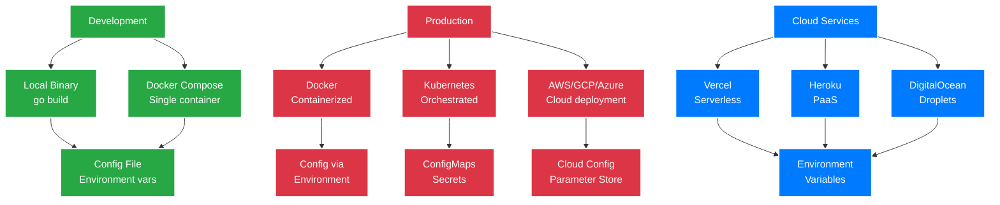

# Deployment


This guide covers deploying COO-LLM in various environments, from development to production.

## Deployment Options



## Quick Start

### Local Development

1. **Clone and build:**
   ```bash
   git clone https://github.com/coo-llm/coo-llm-main.git
   cd coo-llm
   go build -o coo-llm ./cmd/coo-llm
   ```

2. **Configure environment:**
   ```bash
   export OPENAI_API_KEY="sk-your-key"
   export GEMINI_API_KEY="your-gemini-key"
   ```

3. **Create config:**
   ```yaml
   # configs/config.yaml
   version: "1.0"
   server:
     listen: ":2906"

   llm_providers:
     - id: "openai-prod"
       type: "openai"
       api_keys: ["${OPENAI_API_KEY}"]
       base_url: "https://api.openai.com"
       model: "gpt-4o"
       pricing:
         input_token_cost: 0.002
         output_token_cost: 0.01
       limits:
         req_per_min: 200
         tokens_per_min: 100000

   api_keys:
     - key: "test-key"
       allowed_providers: ["*"]
       description: "Test key for development"

    # Use "openai-prod:gpt-4o" directly (no model_aliases needed)
   ```

4. **Run:**
   ```bash
   ./coo-llm -config configs/config.yaml
   ```

5. **Test:**
   ```bash
   curl -X POST http://localhost:2906/v1/chat/completions \
     -H "Authorization: Bearer test-key" \
     -d '{"model": "openai:gpt-4o", "messages": [{"role": "user", "content": "Hello"}]}'
   ```

### Docker Deployment

1. **Build image:**
    ```bash
    docker build -t coo-llm:latest .
    ```

2. **Prepare config:**
    ```bash
    # Create your config.yaml with API keys and settings
    mkdir configs
    # Edit configs/config.yaml
    ```

3. **Run container:**
    ```bash
    docker run -p 2906:2906 \
      -e OPENAI_API_KEY="sk-your-key" \
      -e GEMINI_API_KEY="your-gemini-key" \
      -v $(pwd)/configs:/app/configs \
      -v $(pwd)/logs:/app/logs \
      khapu2906/coo-llm:latest
    ```

**Dockerfile details:**
- Multi-stage build with Go 1.23
- Alpine Linux base image for minimal size
- Non-root user for security
- Config mounted from host for flexibility and security

### Docker Compose

**Full stack with Redis:**
```yaml
# docker-compose.yml
version: '3.8'
services:
  coo-llm:
    build: .
    ports:
      - "2906:2906"
    environment:
      - OPENAI_API_KEY=${OPENAI_API_KEY}
      - GEMINI_API_KEY=${GEMINI_API_KEY}
    depends_on:
      - redis
    volumes:
      - ./configs:/app/configs  # Mount config from host
      - ./logs:/app/logs

  redis:
    image: redis:7
    ports:
      - "6379:6379"
    volumes:
      - redis_data:/data

volumes:
  redis_data:
```

**Redis-only for development:**
```yaml
# docker-compose.local.yml
version: '3.8'
services:
  redis:
    image: redis:7
    ports:
      - "6379:6379"
    volumes:
      - redis_data:/data

volumes:
  redis_data:
```

**Run:**
```bash
# Full stack
docker-compose up -d

# Redis only (for local development)
docker-compose -f docker-compose.local.yml up -d
```

## Production Deployment

### Environment Variables

**Required:**
```bash
export OPENAI_API_KEY="sk-your-key"
export GEMINI_API_KEY="your-gemini-key"  # Optional
export CLAUDE_API_KEY="your-claude-key"  # Optional
```

**Optional:**
```bash
export REDIS_ADDR="redis:6379"           # For Redis storage
export REDIS_PASSWORD="your-password"    # If Redis requires auth
export ADMIN_API_KEY="your-admin-key"    # For admin endpoints (future)
```

### Kubernetes

**Basic Deployment:**
```yaml
apiVersion: apps/v1
kind: Deployment
metadata:
  name: coo-llm
spec:
  replicas: 2
  selector:
    matchLabels:
      app: coo-llm
  template:
    metadata:
      labels:
        app: coo-llm
    spec:
      containers:
      - name: coo-llm
        image: coo-llm:latest
        ports:
        - containerPort: 2906
        env:
        - name: OPENAI_API_KEY
          valueFrom:
            secretKeyRef:
              name: llm-secrets
              key: openai-key
        - name: REDIS_ADDR
          value: "redis-service:6379"
        volumeMounts:
        - name: config
          mountPath: /app/configs
      volumes:
      - name: config
        configMap:
          name: coo-llm-config
```

**Service:**
```yaml
apiVersion: v1
kind: Service
metadata:
  name: coo-llm
spec:
  selector:
    app: coo-llm
  ports:
  - port: 80
    targetPort: 2906
  type: ClusterIP
```

**ConfigMap:**
```yaml
apiVersion: v1
kind: ConfigMap
metadata:
  name: coo-llm-config
data:
  config.yaml: |
    version: "1.0"
    server:
      listen: ":2906"
    storage:
      runtime:
        type: redis
        addr: "${REDIS_ADDR}"
    llm_providers:
      - id: openai
        type: openai
        api_keys: ["${OPENAI_API_KEY}"]
        model: gpt-4o
    # Use "openai:gpt-4o" directly (no model_aliases needed)
```

### AWS ECS

**Task Definition:**
```json
{
  "family": "coo-llm",
  "taskRoleArn": "arn:aws:iam::123456789012:role/ecsTaskRole",
  "executionRoleArn": "arn:aws:iam::123456789012:role/ecsTaskExecutionRole",
  "networkMode": "awsvpc",
  "requiresCompatibilities": ["FARGATE"],
  "cpu": "256",
  "memory": "512",
  "containerDefinitions": [
    {
      "name": "coo-llm",
      "image": "coo-llm:latest",
      "essential": true,
      "portMappings": [
        {
          "containerPort": 2906,
          "hostPort": 2906
        }
      ],
      "environment": [
        {
          "name": "OPENAI_API_KEY",
          "valueFrom": "arn:aws:secretsmanager:region:123456789012:secret:openai-key"
        }
      ],
      "logConfiguration": {
        "logDriver": "awslogs",
        "options": {
          "awslogs-group": "/ecs/coo-llm",
          "awslogs-region": "us-east-1",
          "awslogs-stream-prefix": "ecs"
        }
      }
    }
  ]
}
```

### Docker Swarm

```yaml
# docker-compose.swarm.yml
version: '3.8'
services:
  coo-llm:
    image: khapu2906/coo-llm:latest
    ports:
      - "2906:2906"
    environment:
      - OPENAI_API_KEY=${OPENAI_API_KEY}
    configs:
      - source: truckllm_config
        target: /app/configs/config.yaml
    deploy:
      mode: replicated
      replicas: 3
      restart_policy:
        condition: on-failure

  redis:
    image: redis:7-alpine
    volumes:
      - redis_data:/data
    deploy:
      mode: global

configs:
  truckllm_config:
    file: ./configs/config.yaml

volumes:
  redis_data:
```

## Configuration Management

### Environment Variables

**Development:**
```bash
export OPENAI_API_KEY="sk-..."
export GEMINI_API_KEY="..."
export CLAUDE_API_KEY="..."
export REDIS_URL="redis://localhost:6379"
```

**Production:**
Use secret management services:
- AWS Secrets Manager
- Google Secret Manager
- Azure Key Vault
- HashiCorp Vault

### Config Files

**Directory Structure:**
```
configs/
├── config.yaml          # Main config
├── config.prod.yaml     # Production overrides
├── config.dev.yaml      # Development overrides
└── secrets/             # Encrypted secrets
```

**Environment-specific configs:**
```bash
# Development
./coo-llm -config configs/config.dev.yaml

# Production
./coo-llm -config configs/config.prod.yaml
```

## Networking

### Load Balancing

**nginx:**
```nginx
upstream coo-llm {
    server coo-llm-1:2906;
    server coo-llm-2:2906;
    server coo-llm-3:2906;
}

server {
    listen 80;
    server_name api.example.com;

    location / {
        proxy_pass http://coo-llm;
        proxy_set_header Host $host;
        proxy_set_header X-Real-IP $remote_addr;
    }
}
```

**AWS ALB:**
- Target Group: EC2 instances or ECS tasks
- Health Check: `GET /health`
- SSL Termination: ACM certificate

### Security

**TLS Configuration:**
```yaml
server:
  listen: ":8443"
  tls:
    cert_file: "/etc/ssl/certs/coo-llm.crt"
    key_file: "/etc/ssl/private/coo-llm.key"
```

**nginx with TLS:**
```nginx
server {
    listen 443 ssl;
    server_name api.example.com;

    ssl_certificate /etc/ssl/certs/api.crt;
    ssl_certificate_key /etc/ssl/private/api.key;

    location / {
        proxy_pass http://coo-llm;
        proxy_set_header X-Forwarded-Proto $scheme;
    }
}
```

## Monitoring

### Metrics

**Prometheus metrics are available at `/metrics` when enabled:**

```yaml
logging:
  prometheus:
    enabled: true
    endpoint: "/metrics"
```

**Prometheus config:**
```yaml
scrape_configs:
  - job_name: 'coo-llm'
    static_configs:
      - targets: ['coo-llm:2906']
    metrics_path: '/metrics'
```

### Logging

**File logging:**
```yaml
logging:
  file:
    enabled: true
    path: "./logs/llm.log"
    max_size_mb: 100
    max_backups: 5
```

**Logs include:**
- Request details (model, tokens, latency)
- Provider selection
- Errors and retries
- Usage metrics

### Logging

**Centralized Logging:**
```yaml
logging:
  providers:
    - name: "elasticsearch"
      type: "http"
      endpoint: "https://es.example.com/_bulk"
```

**Log Aggregation:**
- ELK Stack (Elasticsearch, Logstash, Kibana)
- Splunk
- Datadog
- CloudWatch Logs

## Scaling

### Multiple API Keys

**Add multiple keys per provider for higher throughput:**
```yaml
llm_providers:
  - id: "openai-prod"
    type: "openai"
    api_keys: ["${OPENAI_KEY_1}", "${OPENAI_KEY_2}", "${OPENAI_KEY_3}"]
    limits:
      req_per_min: 200  # Per key
      tokens_per_min: 100000
```

### Redis for Production

**Use Redis for persistent metrics and caching:**
```yaml
storage:
  runtime:
    type: "redis"
    addr: "redis:6379"
    password: "${REDIS_PASSWORD}"
```

## Troubleshooting

### Common Issues

**Application won't start:**
```bash
# Check config syntax
./coo-llm -config configs/config.yaml

# Check environment variables
echo $OPENAI_API_KEY
```

**Requests failing:**
```bash
# Test basic connectivity
curl -X POST http://localhost:2906/v1/chat/completions \
  -H "Authorization: Bearer test-key" \
  -d '{"model": "openai:gpt-4o", "messages": [{"role": "user", "content": "Hello"}]}'

# Check logs
tail -f logs/llm.log
```

**Rate limiting errors:**
- Check your API key limits with the provider
- Add more API keys to your configuration
- Reduce request frequency

### Logs

**Log files are written to `./logs/llm.log` by default:**
```yaml
logging:
  file:
    enabled: true
    path: "./logs/llm.log"
    max_size_mb: 100
    max_backups: 5
```

**Log entries include:**
- Request timestamps and models
- Token usage and latency
- Provider selection decisions
- Errors and retry attempts

## Security

### API Key Management

**Store API keys securely:**
```bash
# Environment variables (recommended)
export OPENAI_API_KEY="sk-your-secure-key"

# Or use a secrets file (not in repo)
echo "OPENAI_API_KEY=sk-your-key" > .env
```

**Client authentication:**
```yaml
api_keys:
  - key: "production-key"
    allowed_providers: ["openai-prod", "gemini-prod"]
    description: "Production client"
```

### Best Practices

- Use different API keys for different environments
- Rotate keys regularly
- Monitor usage patterns
- Use HTTPS in production
- Limit API key permissions with `allowed_providers`