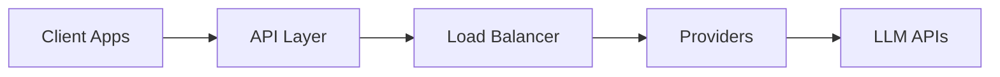

# Architecture

This document describes the high-level architecture of COO-LLM, including component interactions and design decisions.

## System Overview

COO-LLM follows a modular, plugin-based architecture designed for extensibility and maintainability. The system is built in Go and uses a layered architecture pattern.

**Detail:**

```mermaid
flowchart TD
    classDef client fill:#28a745,color:#fff,stroke:#fff,stroke-width:2px
    classDef api fill:#28a745,color:#fff,stroke:#fff,stroke-width:2px
    classDef balancer fill:#dc3545,color:#fff,stroke:#fff,stroke-width:2px
    classDef provider fill:#ffc107,color:#000,stroke:#000,stroke-width:2px
    classDef external fill:#007bff,color:#fff,stroke:#fff,stroke-width:2px

    A[Client Applications<br/>OpenAI SDK, LangChain, Custom Clients]:::client
    A --> B[API Layer<br/>internal/api]:::api

    subgraph B["API Layer  <internal/api >"]
        B1[OpenAI-Compatible Endpoints<br/>/v1/*<br/>POST /v1/chat/completions<br/>GET /v1/models]:::api
        B2[Admin API<br/>/admin/v1/*<br/>Configuration management<br/>Provider status]:::api
    end

    B --> C[Load Balancer<br/>internal/balancer]:::balancer

    subgraph C["Load Balancer  <internal/balancer >"]
        C1[Selector<br/>selector.go<br/>Model alias resolution<br/>Provider/key selection<br/>Round Robin, Least Loaded, Hybrid]:::balancer
        C2[Usage Tracking<br/>Request counts, token usage<br/>Errors, latency<br/>Rate limit checking]:::balancer
    end

    C --> D[Provider Registry<br/>internal/provider]:::provider

    subgraph D["Provider Registry  <internal/provider >"]
        D1[Provider Interface<br/>interface.go<br/>Generate<ctx, req> method<br/>ListModels <ctx > method]:::provider
        D2[Provider Implementations<br/>OpenAI  <openai.go ><br/>Gemini  <gemini.go ><br/>Claude  <claude.go ><br/>Custom  <custom.go >]:::provider
        D3[Registry<br/>registry.go<br/>Load providers from config<br/>Provider registration and lookup]:::provider
    end

    D --> E[Storage & Observability]:::storage

     subgraph E["Storage & Observability"]
         E1[Runtime Storage<br/>internal/store<br/>Redis, Memory, HTTP, File<br/>Client/Metrics/Algorithm Stores]:::storage
         E2[Configuration<br/>internal/config<br/>YAML parsing with viper<br/>Environment variables<br/>Validation]:::storage
         E3[Logging<br/>internal/log<br/>Structured JSON  <Zerolog ><br/>File rotation<br/>Prometheus metrics<br/>Audit logging]:::storage
     end

    E --> F[External LLM Providers]:::external

    subgraph F["External LLM Providers"]
        F1[OpenAI API<br/>GPT-4, GPT-3.5]:::external
        F2[Google Gemini API<br/>1.5 Pro, etc.]:::external
        F3[Anthropic Claude API<br/>Opus, Sonnet]:::external
        F4[Custom LLM APIs]:::external
    end
```

## Core Components

### API Layer (internal/api)

The API layer provides OpenAI-compatible REST endpoints using Chi router. It handles:

- Request validation and JSON parsing
- Authentication via API key middleware
- Model alias resolution and provider selection
- Response caching (optional)
- Retry logic with configurable attempts and timeouts
- Usage tracking and metrics collection

**Key Files:**
- `internal/api/chat_completions.go` - Main chat completions handler with retry logic
- `internal/api/models.go` - Models endpoint (not implemented yet)
- `internal/api/admin.go` - Admin endpoints (not implemented yet)

### Load Balancer Engine (internal/balancer)

The core intelligence of COO-LLM implemented in `selector.go`. Responsible for:

- **Model Resolution**: Maps model aliases (e.g., "gpt-4o") to provider:model combinations
- **Provider Selection**: Chooses optimal provider based on availability
- **Key Selection**: Implements three algorithms:
  - Round Robin: Simple cycling through keys
  - Least Loaded: Selects key with lowest token usage
  - Hybrid: Weighted scoring of req usage, token usage, errors, latency, cost
- **Rate Limiting**: Checks per-key limits for requests/minute and tokens/minute
- **Usage Tracking**: Updates metrics for requests, tokens, errors, latency

**Key Files:**
- `internal/balancer/selector.go` - Main selection logic and algorithms

### Provider Registry (internal/provider)

Plugin system for LLM providers with clean interfaces:

- **Provider Interface**: `LLMProvider` with `Generate()` and `ListModels()` methods
- **Provider Types**: OpenAI, Gemini, Claude, Custom
- **Registry**: Loads providers from config, manages provider instances
- **Request/Response Types**: Standardized `LLMRequest` and `LLMResponse` structs

**Key Files:**
- `internal/provider/interface.go` - Core interfaces and types
- `internal/provider/registry.go` - Provider registration and loading
- `internal/provider/openai.go` - OpenAI API implementation
- `internal/provider/gemini.go` - Google Gemini implementation
- `internal/provider/claude.go` - Anthropic Claude implementation
- `internal/provider/custom.go` - Custom provider template

### Configuration System (internal/config)

YAML-based configuration with viper integration:

- **Config Structure**: `Config` struct with sections for server, logging, storage, providers, etc.
- **LLMProviders**: New format replacing legacy providers (supports multiple API keys per provider)
- **Model Aliases**: Maps user-friendly names to provider:model pairs
- **Policy Config**: Load balancing algorithm and hybrid weights
- **Validation**: Ensures required fields and valid values

**Key Files:**
- `internal/config/config.go` - Main config structs and loading logic
- `internal/config/config_test.go` - Configuration tests

### Storage System (internal/store)

Runtime storage for metrics and caching:

- **RuntimeStore Interface**: Methods for usage tracking, caching, sliding windows
- **Backends**: Redis (production), Memory (dev), HTTP (remote), File
- **Usage Metrics**: req, tokens, errors, latency per provider/key
- **Caching**: Optional response caching with TTL

**Key Files:**
- `internal/store/interface.go` - Storage interfaces
- `internal/store/redis.go` - Redis implementation

- `internal/store/http.go` - HTTP-based remote storage
- `internal/store/file.go` - File-based storage

### Logging System (internal/log)

Observability with structured logging:

- **Logger Interface**: Request logging with context
- **Backends**: File with rotation, Prometheus metrics
- **Log Entries**: Provider, model, latency, tokens, status, errors
- **Metrics**: Prometheus integration for monitoring

**Key Files:**
- `internal/log/logger.go` - Main logging implementation
- `internal/log/logger_test.go` - Logging tests

## Design Principles

### Modularity
Each component has clear interfaces and responsibilities. Components can be replaced or extended without affecting others.

### Extensibility
Plugin-based architecture allows adding new providers, storage backends, and logging systems via interfaces.

### Performance
Built with Go's concurrency model. Minimal overhead in request routing. Efficient data structures for metrics tracking.

### Reliability
Comprehensive error handling, retries, and fallback mechanisms. Health checks and monitoring.

### Observability
Rich metrics, structured logging, and admin APIs for debugging and monitoring.

## Data Flow

1. **Request Reception**: `chat_completions.go` receives POST /v1/chat/completions
2. **Authentication**: `AuthMiddleware` validates Bearer token against `api_keys` config
3. **Model Resolution**: `GetProviderFromModel()` maps model alias to provider ID using `model_aliases`
4. **Provider Selection**: `selector.SelectBest()` resolves model to provider:model, selects provider
5. **Key Selection**: `selector.selectKey()` chooses optimal API key using configured algorithm:
   - Round Robin: Cycle through available keys
   - Least Loaded: Select key with lowest token usage
   - Hybrid: Calculate weighted score (req, token, error, latency, cost)
6. **Rate Limit Check**: Verify key hasn't exceeded req/min or tokens/min limits
7. **Request Execution**: Provider's `Generate()` method makes external API call
8. **Retry Logic**: On failure, retry up to `max_attempts` with `interval` delays
9. **Response Processing**: Parse LLM response, extract token counts and finish reason
10. **Usage Tracking**: Update storage with req, input_tokens, output_tokens, latency, errors
11. **Caching**: Optionally cache response if enabled and prompt matches
12. **Logging**: Record request details via `logger.LogRequest()`
13. **Response**: Return OpenAI-formatted JSON response to client

## Configuration

Configuration is centralized in YAML format with support for:

- Environment variable substitution
- Hot-reload capabilities
- Validation and defaults
- Hierarchical overrides

See [Configuration](../Guides/Configuration.md) for details.

## Security Considerations

- API key encryption at rest
- Request rate limiting
- Input validation and sanitization
- Secure communication with external providers
- Audit logging for compliance