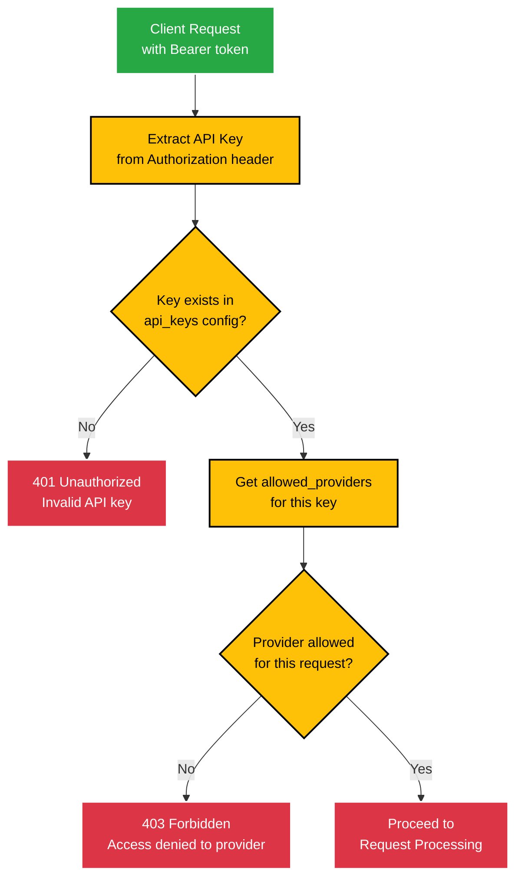
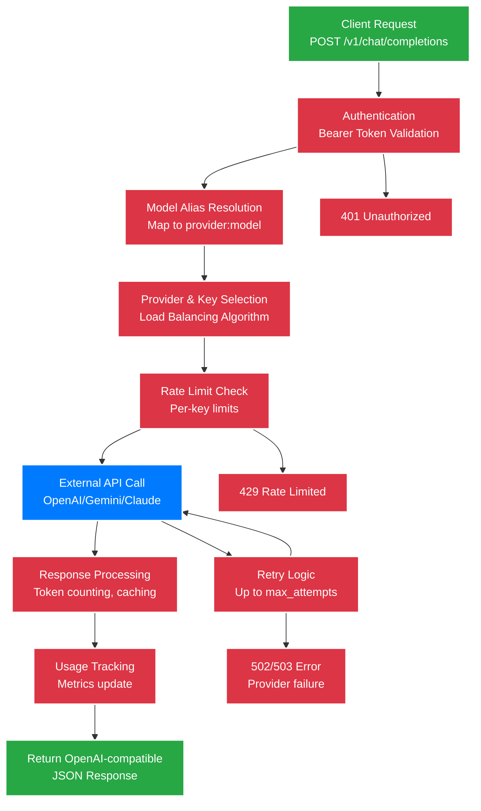

# API Reference

COO-LLM provides OpenAI-compatible REST APIs for LLM interactions, plus administrative endpoints for management.

## Authentication

All API requests require authentication via Bearer token:

```
Authorization: Bearer <api_key>
```

API keys are configured in the providers section and mapped to specific keys.

## Model Resolution

COO-LLM supports 3 ways to specify models:

1. **Direct provider:model syntax**: `provider_id:model_name` (e.g., `openai:gpt-4o`, `custom:my-model`)
2. **Model aliases**: Short names mapped to provider:model (e.g., `gpt-4o` → `openai:gpt-4o`)
3. **Pattern matching fallback**: Infer provider from model name (e.g., `gpt-4o` → OpenAI provider)

## Authentication & Authorization Flow



## API Request Flow



## OpenAI-Compatible Endpoints

### POST /v1/chat/completions

Generate chat completions using available models. This is the primary endpoint implemented in COO-LLM.

**Request Body:**
```json
{
  "model": "gpt-4o",
  "messages": [
    {
      "role": "user",
      "content": "Hello, how are you?"
    }
  ],
  "max_tokens": 100
}
```

**Response:**
```json
{
  "id": "chatcmpl-1234567890",
  "object": "chat.completion",
  "created": 1699123456,
  "model": "gpt-4o",
  "choices": [
    {
      "index": 0,
      "message": {
        "role": "assistant",
        "content": "Hello! I'm doing well, thank you for asking."
      },
      "finish_reason": "stop"
    }
  ],
  "usage": {
    "prompt_tokens": 13,
    "completion_tokens": 7,
    "total_tokens": 20,
    "cost": 0.000036
  }
}
```

**Parameters:**
- `model` (string, required): Model alias from configuration (e.g., "gpt-4o", "gemini-1.5-pro")
- `messages` (array, required): Chat messages with role/content format
- `max_tokens` (integer, optional): Maximum tokens to generate (default: 1000)
- Additional parameters are passed through to the provider

**Features:**
- ✅ Conversation history support
- ✅ Model alias resolution
- ✅ Automatic provider selection and load balancing
- ✅ Rate limiting and retry logic
- ✅ Response caching (if enabled)
- ✅ Usage tracking and cost calculation
- ✅ Comprehensive logging

### GET /v1/models

List available models based on configured model aliases.

**Response:**
```json
{
  "object": "list",
  "data": [
    {
      "id": "gpt-4o",
      "object": "model",
      "created": 1699123456,
      "owned_by": "coo-llm"
    },
    {
      "id": "gemini-1.5-pro",
      "object": "model",
      "created": 1699123456,
      "owned_by": "coo-llm"
    }
  ]
}
```

**Note:** Models are listed based on `model_aliases` configuration, not actual provider models.

## Admin API Endpoints

**Note:** Admin API endpoints are not yet implemented in the current version. The following are planned for future releases:

### Planned Admin Endpoints

- `GET /admin/v1/config` - Get current configuration
- `POST /admin/v1/config` - Update configuration
- `POST /admin/v1/config/validate` - Validate configuration
- `POST /admin/v1/reload` - Reload configuration from file
- `GET /admin/v1/providers` - Get provider status and metrics
- `GET /admin/v1/logs` - Get recent log entries

### Current Admin Access

Currently, configuration management is done via:
- Configuration file reloading (restart required)
- Direct file editing
- Environment variable changes

Admin functionality will be added in future versions.

## Metrics Endpoint

### GET /metrics

Prometheus metrics endpoint (enabled when `logging.prometheus.enabled: true`).

**Response:** Prometheus format metrics

```
# HELP llm_requests_total Total number of LLM requests
# TYPE llm_requests_total counter
llm_requests_total{provider="openai",model="gpt-4"} 1250

# HELP llm_request_duration_seconds Request duration in seconds
# TYPE llm_request_duration_seconds histogram
llm_request_duration_seconds_bucket{provider="openai",le="0.1"} 1200
...
```

**Available Metrics:**
- Request counts by provider/model
- Request duration histograms
- Error rates
- Token usage tracking
- Active connections

**Configuration:**
```yaml
logging:
  prometheus:
    enabled: true
    endpoint: "/metrics"
```

## Admin API

Administrative endpoints for configuration and monitoring (require admin authentication):

### Authentication
```bash
curl -H "Authorization: Bearer your-admin-key" http://localhost:2906/admin/v1/config
```

### Endpoints

#### GET /admin/v1/config
Get current configuration (sensitive data masked).

**Response:**
```json
{
  "version": "1.0",
  "server": {
    "listen": ":2906",
    "admin_api_key": "****"
  },
  "llm_providers": [...],
  "api_keys": [...]
}
```

#### POST /admin/v1/config/validate
Validate configuration without applying.

**Request Body:** Full config JSON
**Response:** `{"message": "Config is valid"}` or error

#### GET /admin/v1/metrics
Retrieve historical metrics data.

**Query Parameters:**
- `name`: Metric name (`latency`, `tokens`, `cost`) - default: `latency`
- `start`: Start timestamp (Unix seconds) - default: 1 hour ago
- `end`: End timestamp (Unix seconds) - default: now

**Response:**
```json
{
  "name": "latency",
  "start": 1700000000,
  "end": 1700003600,
  "points": [
    {
      "value": 150.5,
      "timestamp": 1700000100
    }
  ]
}
```

**Metrics Tags:** `provider`, `key`, `model`, `client_key`

#### GET /admin/v1/clients
Get aggregated statistics per client API key.

**Query Parameters:**
- `start`: Start timestamp (Unix seconds) - default: 24 hours ago
- `end`: End timestamp (Unix seconds) - default: now

**Response:**
```json
{
  "start": 1700000000,
  "end": 1700003600,
  "client_stats": {
    "test-12": {
      "queries": 150,
      "tokens": 25000,
      "cost": 0.125
    },
    "gemini-only": {
      "queries": 75,
      "tokens": 15000,
      "cost": 0.075
    }
  }
}
```

#### GET /admin/v1/stats
Get aggregated statistics with flexible grouping and filtering.

**Query Parameters:**
- `group_by`: Comma-separated list of dimensions to group by (e.g., `client_key,provider`) - default: `client_key`
- `start`: Start timestamp (Unix seconds) - default: 24 hours ago
- `end`: End timestamp (Unix seconds) - default: now
- `client_key`: Filter by specific client key
- `provider`: Filter by specific provider
- `key`: Filter by specific provider key

**Supported group_by dimensions:**
- `client_key`: Group by client API key
- `provider`: Group by provider ID
- `key`: Group by provider key ID
- `model`: Group by model name

**Response:**
```json
{
  "start": 1700000000,
  "end": 1700003600,
  "group_by": ["client_key", "provider"],
  "filters": {"client_key": "test-12"},
  "stats": {
    "test-12": {
      "openai": {
        "queries": 100,
        "tokens": 15000,
        "cost": 0.075
      },
      "gemini": {
        "queries": 50,
        "tokens": 10000,
        "cost": 0.050
      }
    }
  }
}
```

## Error Responses

All endpoints return standard HTTP status codes:

- `200`: Success
- `400`: Bad Request (invalid parameters)
- `401`: Unauthorized (invalid API key)
- `403`: Forbidden (rate limited or quota exceeded)
- `404`: Not Found (invalid endpoint or model)
- `429`: Too Many Requests (rate limited)
- `500`: Internal Server Error
- `502`: Bad Gateway (provider error)
- `503`: Service Unavailable (provider down)

Error response format:
```json
{
  "error": {
    "message": "Invalid model specified",
    "type": "invalid_request_error",
    "code": 400
  }
}
```

## Rate Limiting

COO-LLM implements rate limiting based on configured limits:

- Per-key request limits
- Per-key token limits
- Global rate limits

Rate limited requests return `429` status with retry information.

## Streaming

Streaming responses are supported for chat completions:

```bash
curl -X POST http://localhost:2906/v1/chat/completions \
  -H "Authorization: Bearer your-key" \
  -d '{"model": "gpt-4", "messages": [{"role": "user", "content": "Tell me a story"}], "stream": true}'
```

Response is Server-Sent Events format.

## Examples

### Python Client

```python
import openai

# Point to COO-LLM instead of OpenAI
client = openai.OpenAI(
    api_key="dummy-key",  # COO-LLM ignores this, uses config-based auth
    base_url="http://localhost:2906/v1"
)

response = client.chat.completions.create(
    model="gpt-4o",
    messages=[{"role": "user", "content": "Hello!"}]
)

print(response.choices[0].message.content)
```

### cURL Examples

```bash
# Chat completion with API key auth
curl -X POST http://localhost:2906/v1/chat/completions \
  -H "Authorization: Bearer test-key" \
  -H "Content-Type: application/json" \
  -d '{
    "model": "gpt-4o",
    "messages": [{"role": "user", "content": "Hello"}]
  }'

# List available models
curl http://localhost:2906/v1/models \
  -H "Authorization: Bearer test-key"

# Prometheus metrics
curl http://localhost:2906/metrics
```

## Authentication

COO-LLM uses API key authentication via the `Authorization: Bearer <key>` header. API keys are configured in the `api_keys` section and map to allowed providers.

```yaml
api_keys:
  - key: "client-a-key"
    allowed_providers: ["openai-prod"]  # Limited access
  - key: "premium-key"
    allowed_providers: ["*"]  # Full access
```

## SDK Compatibility

COO-LLM is compatible with:

- OpenAI Python SDK (`openai>=1.0`)
- OpenAI Node.js SDK
- Any HTTP client following OpenAI Chat Completions API format

Simply change the `base_url` to point to your COO-LLM instance and use any API key from your configuration.