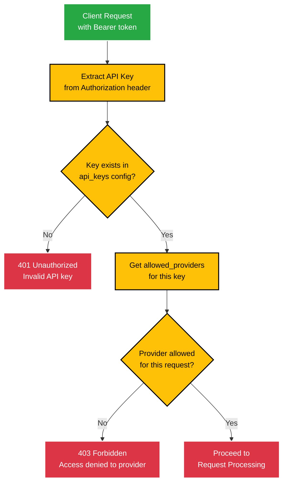
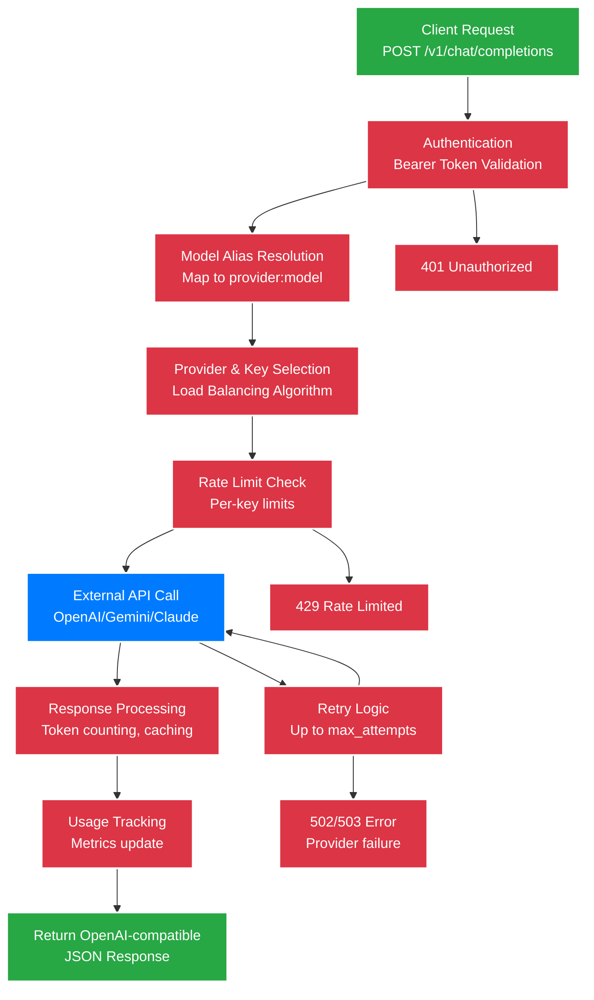

# LLM API Reference

OpenAI-compatible REST APIs for LLM interactions.

## Authentication

All API requests require authentication via Bearer token:

```
Authorization: Bearer <api_key>
```

API keys are configured in the `api_keys` section and mapped to specific providers.

## Model Resolution

COO-LLM supports 3 ways to specify models:

1. **Direct provider:model syntax**: `provider_id:model_name` (e.g., `openai:gpt-4o`, `custom:my-model`)
2. **Model aliases**: Short names mapped to provider:model (e.g., `gpt-4o` → `openai:gpt-4o`)
3. **Pattern matching fallback**: Infer provider from model name (e.g., `gpt-4o` → OpenAI provider)

## Authentication & Authorization Flow



## API Request Flow



## OpenAI-Compatible Endpoints

### POST /v1/chat/completions

Generate chat completions using available models. This is the primary endpoint implemented in COO-LLM.

**Request Body:**
```json
{
  "model": "gpt-4o",
  "messages": [
    {
      "role": "user",
      "content": "Hello, how are you?"
    }
  ],
  "max_tokens": 100
}
```

**Response:**
```json
{
  "id": "chatcmpl-1234567890",
  "object": "chat.completion",
  "created": 1699123456,
  "model": "gpt-4o",
  "choices": [
    {
      "index": 0,
      "message": {
        "role": "assistant",
        "content": "Hello! I'm doing well, thank you for asking. How can I help you today?"
      },
      "finish_reason": "stop"
    }
  ],
  "usage": {
    "prompt_tokens": 13,
    "completion_tokens": 17,
    "total_tokens": 30
  }
}
```

**Parameters:**

| Parameter | Type | Required | Default | Description |
|-----------|------|----------|---------|-------------|
| `model` | string | Yes | - | Model identifier (provider:model or alias) |
| `messages` | array | Yes | - | Array of message objects |
| `max_tokens` | int | No | Provider default | Maximum tokens to generate |
| `temperature` | float | No | 1.0 | Sampling temperature (0.0-2.0) |
| `top_p` | float | No | 1.0 | Nucleus sampling (0.0-1.0) |
| `stream` | bool | No | false | Enable streaming response |
| `stop` | string/array | No | - | Stop sequences |
| `presence_penalty` | float | No | 0.0 | Presence penalty (-2.0-2.0) |
| `frequency_penalty` | float | No | 0.0 | Frequency penalty (-2.0-2.0) |
| `user` | string | No | - | A unique identifier representing your end-user. |

**Note:** Other OpenAI-compatible parameters (e.g., `temperature`, `top_p`, `stop`, `presence_penalty`, `frequency_penalty`) are passed through to the underlying provider.

### Streaming Response

When `stream: true`, responses are sent as Server-Sent Events:

```
data: {"id": "chatcmpl-123", "object": "chat.completion.chunk", "choices": [{"delta": {"content": "Hello"}}]}

data: {"id": "chatcmpl-123", "object": "chat.completion.chunk", "choices": [{"delta": {"content": "!"}}]}

data: [DONE]
```

### Error Responses

All errors follow OpenAI format:

```json
{
  "error": {
    "message": "Invalid API key",
    "type": "authentication_error",
    "code": 401
  }
}
```

## Supported Models

COO-LLM supports models from all configured providers:

- **OpenAI**: gpt-4o, gpt-4-turbo, gpt-3.5-turbo, etc.
- **Gemini**: gemini-1.5-pro, gemini-2.0-flash, etc.
- **Claude**: claude-3-opus, claude-3-sonnet, etc.
- **Custom**: Any provider with custom adapter

Use `provider:model` syntax for explicit selection.