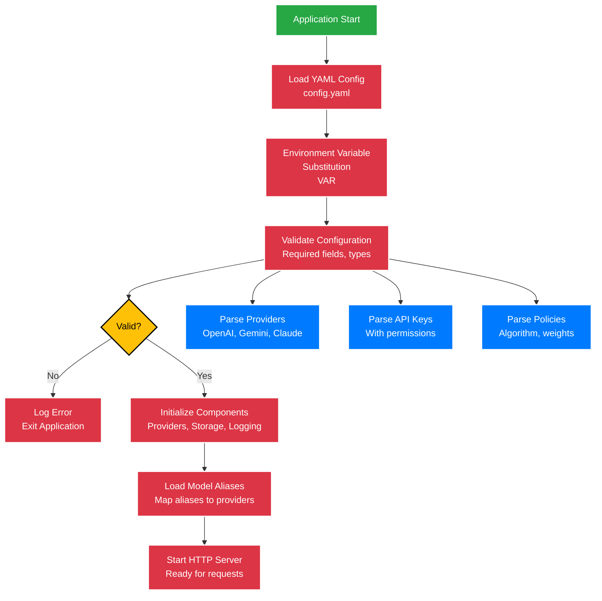

# Configuration

COO-LLM uses YAML configuration files for all settings. The configuration is hierarchical and supports environment variable substitution, validation, and hot-reload.

## Configuration Loading Flow



## Configuration File Structure

```yaml
version: "1.0"

server:
   listen: ":2906"
  admin_api_key: "admin-secret"

logging:
  file:
    enabled: true
    path: "./logs/llm.log"
    max_size_mb: 100
    max_backups: 5
  prometheus:
    enabled: true
    endpoint: "/metrics"

storage:
  config:
    type: "file"
    path: "./configs/config.yaml"
  runtime:
    type: "redis"  # redis, memory, http, file
    addr: "localhost:6379"
    password: ""
    api_key: ""

llm_providers:
   - id: "openai"
     type: "openai"
     api_keys: ["${OPENAI_API_KEY}"]
     base_url: "https://api.openai.com/v1"
     model: "gpt-4o"
     pricing:
       input_token_cost: 0.002
       output_token_cost: 0.01
     limits:
       req_per_min: 200
       tokens_per_min: 100000
   - id: "gemini"
     type: "gemini"
     api_keys: ["${GEMINI_API_KEY}"]
     base_url: "https://generativelanguage.googleapis.com/v1beta"
     model: "gemini-1.5-pro"
     pricing:
       input_token_cost: 0.00025
       output_token_cost: 0.0005
     limits:
       req_per_min: 150
       tokens_per_min: 80000
   - id: "claude"
     type: "claude"
     api_keys: ["${CLAUDE_API_KEY}"]
     base_url: "https://api.anthropic.com"
     model: "claude-3-opus-20240229"
     pricing:
       input_token_cost: 0.015
       output_token_cost: 0.075
     limits:
       req_per_min: 100
       tokens_per_min: 60000

api_keys:
   - key: "default-key"
     allowed_providers: ["*"]  # Access all providers
     description: "Default API key for all providers"

model_aliases:
   # OpenAI models
   gpt-4o: openai:gpt-4o
   gpt-4o-mini: openai:gpt-4o-mini
   gpt-4-turbo: openai:gpt-4-turbo
   gpt-4: openai:gpt-4
   gpt-3.5-turbo: openai:gpt-3.5-turbo
   gpt-3.5-turbo-instruct: openai:gpt-3.5-turbo-instruct
   # Gemini models
   gemini-1.5-pro: gemini:gemini-1.5-pro
   gemini-1.5-flash: gemini:gemini-1.5-flash
   gemini-1.0-pro: gemini:gemini-1.0-pro
   gemini-2.0-flash-exp: gemini:gemini-2.0-flash-exp
   gemini-2.0-pro-exp: gemini:gemini-2.0-pro-exp
   # Claude models
   claude-3-opus: claude:claude-3-opus-20240229
   claude-3-sonnet: claude:claude-3-sonnet-20240229
   claude-3-haiku: claude:claude-3-haiku-20240307
   claude-3-5-sonnet: claude:claude-3-5-sonnet-20240620

policy:
  strategy: "hybrid"
  algorithm: "hybrid"   # round_robin, least_loaded, hybrid
  priority: "balanced"  # balanced, cost, req, token (auto-sets weights)
  hybrid_weights:       # Auto-set based on priority, or customize
    token_ratio: 0.2
    req_ratio: 0.2
    error_score: 0.2
    latency: 0.2
    cost_ratio: 0.2
  retry:
    max_attempts: 3      # Max retry attempts
    timeout: "30s"       # Timeout per attempt
    interval: "1s"       # Interval between retries
  cache:
    enabled: true        # Enable response caching
    ttl_seconds: 10      # Cache TTL (10 seconds)
```

## Configuration Sections

### Server Configuration

| Field | Type | Default | Description |
|-------|------|---------|-------------|
| `listen` | string | `:2906` | Server listen address |
| `admin_api_key` | string | - | API key for admin endpoints |

### Logging Configuration

#### File Logging
| Field | Type | Default | Description |
|-------|------|---------|-------------|
| `enabled` | bool | `true` | Enable file logging |
| `path` | string | `./logs/llm.log` | Log file path |
| `max_size_mb` | int | `100` | Max file size in MB |
| `max_backups` | int | `5` | Max backup files |

#### Prometheus Logging
| Field | Type | Default | Description |
|-------|------|---------|-------------|
| `enabled` | bool | `true` | Enable Prometheus metrics |
| `endpoint` | string | `/metrics` | Metrics endpoint path |

#### Log Providers
Array of log provider configurations:

| Field | Type | Description |
|-------|------|-------------|
| `name` | string | Provider name |
| `type` | string | Provider type (`http`, `prometheus`, etc.) |
| `endpoint` | string | HTTP endpoint for webhooks |
| `batch.enabled` | bool | Enable batching |
| `batch.size` | int | Batch size |
| `batch.interval_seconds` | int | Batch interval |

### Storage Configuration

#### Config Storage
| Field | Type | Default | Description |
|-------|------|---------|-------------|
| `type` | string | `file` | Storage type (`file`, `http`) |
| `path` | string | `./configs/config.yaml` | File path (for file type) |

#### Runtime Storage
| Field | Type | Default | Description |
|-------|------|---------|-------------|
| `type` | string | `redis` | Storage type (`redis`, `file`, `http`) |
| `addr` | string | `localhost:6379` | Redis address or HTTP endpoint |
| `password` | string | - | Redis password |
| `api_key` | string | - | API key for HTTP storage |

### LLM Provider Configuration

Array of LLM provider configurations:

| Field | Type | Description |
|-------|------|-------------|
| `id` | string | Unique provider ID (used in model aliases) |
| `type` | string | Provider type: `openai`, `gemini`, `claude`, `custom` |
| `api_keys` | []string | Array of API keys for this provider |
| `base_url` | string | Provider API base URL (optional, uses default if not set) |
| `model` | string | Default model for this provider |
| `pricing.input_token_cost` | float64 | Cost per 1K input tokens |
| `pricing.output_token_cost` | float64 | Cost per 1K output tokens |
| `limits.req_per_min` | int | Request rate limit per key |
| `limits.tokens_per_min` | int | Token rate limit per key |

### API Key Permissions

Array of client API key configurations:

| Field | Type | Description |
|-------|------|-------------|
| `key` | string | Client API key for authentication |
| `allowed_providers` | []string | Array of allowed provider IDs or `["*"]` for all |
| `description` | string | Human-readable description |

### Model Aliases

Map of alias names to provider:model combinations:

```yaml
model_aliases:
  gpt-4o: openai-prod:gpt-4o
  smart-model: gemini-prod:gemini-1.5-pro
```

### Policy Configuration

Load balancing and routing policy:

| Field | Type | Default | Description |
|-------|------|---------|-------------|
| `strategy` | string | `hybrid` | Legacy field, use `algorithm` |
| `algorithm` | string | `round_robin` | Algorithm: `round_robin`, `least_loaded`, `hybrid` |
| `priority` | string | `balanced` | Priority preset: `balanced`, `cost`, `req`, `token` |
| `hybrid_weights.*` | float64 | - | Manual weights for hybrid scoring (0.0-1.0) |
| `retry.max_attempts` | int | `3` | Maximum retry attempts on failure |
| `retry.timeout` | duration | `30s` | Timeout per attempt |
| `retry.interval` | duration | `1s` | Delay between retries |
| `cache.enabled` | bool | `true` | Enable response caching |
| `cache.ttl_seconds` | int64 | `10` | Cache TTL in seconds |

### Model Aliases

Map of alias names to provider:model combinations:

```yaml
model_aliases:
  gpt-4: openai:gpt-4
  smart-model: gemini:gemini-1.5-pro
```

### Policy Configuration

Load balancing algorithm configuration:

| Field | Type | Default | Description |
|-------|------|---------|-------------|
| `algorithm` | string | `round_robin` | Algorithm: `round_robin`, `least_loaded`, `hybrid` |
| `priority` | string | `balanced` | Priority: `balanced`, `cost`, `req`, `token` (auto-sets weights) |
| `hybrid_weights.*` | float64 | - | Manual weights for hybrid scoring |

## Environment Variables

Configuration supports environment variable substitution:

```yaml
providers:
  - keys:
      - secret: "${OPENAI_API_KEY}"
```

Set environment variables before running:

```bash
export OPENAI_API_KEY="sk-your-key"
./coo-llm -config config.yaml
```

## Configuration Validation

COO-LLM validates configuration on startup:

- Required fields presence
- URL format validation
- Numeric range checks
- Provider and key uniqueness

Invalid configurations will prevent startup with detailed error messages.

## Hot Reload

Configuration can be reloaded without restarting:

```bash
curl -X POST http://localhost:2906/admin/v1/reload \
  -H "Authorization: Bearer your-admin-key"
```

## Example Configurations

### Minimal Configuration

```yaml
version: "1.0"
server:
  listen: ":2906"

llm_providers:
  - id: "openai"
    type: "openai"
    api_keys: ["sk-your-key"]
    model: "gpt-4o"

model_aliases:
  gpt-4o: openai:gpt-4o
```

### Production Configuration

```yaml
version: "1.0"
server:
  listen: ":2906"
  admin_api_key: "${ADMIN_KEY}"

logging:
  file:
    enabled: true
    path: "/var/log/coo-llm/llm.log"
  prometheus:
    enabled: true

storage:
  runtime:
    type: "redis"
    addr: "redis:6379"
    password: "${REDIS_PASSWORD}"

llm_providers:
  - id: "openai-prod"
    type: "openai"
    api_keys: ["${OPENAI_KEY_1}", "${OPENAI_KEY_2}"]
    base_url: "https://api.openai.com"
    model: "gpt-4o"
    pricing:
      input_token_cost: 0.002
      output_token_cost: 0.01
    limits:
      req_per_min: 200
      tokens_per_min: 100000
  - id: "gemini-prod"
    type: "gemini"
    api_keys: ["${GEMINI_KEY_1}"]
    base_url: "https://generativelanguage.googleapis.com"
    model: "gemini-1.5-pro"
    pricing:
      input_token_cost: 0.00025
      output_token_cost: 0.0005
    limits:
      req_per_min: 150
      tokens_per_min: 80000

api_keys:
  - key: "client-a-key"
    allowed_providers: ["openai-prod"]
    description: "Client A - OpenAI only"
  - key: "premium-key"
    allowed_providers: ["openai-prod", "gemini-prod"]
    description: "Premium client with all providers"

model_aliases:
  gpt-4o: openai-prod:gpt-4o
  gemini-pro: gemini-prod:gemini-1.5-pro

policy:
  algorithm: "hybrid"
  priority: "balanced"
  retry:
    max_attempts: 3
    timeout: "30s"
  cache:
    enabled: true
    ttl_seconds: 10
```

## Configuration API

Manage configuration via REST API:

```bash
# Get current config
curl http://localhost:2906/admin/v1/config

# Update config
curl -X POST http://localhost:2906/admin/v1/config \
  -H "Content-Type: application/json" \
  -d @new-config.json

# Validate config
curl -X POST http://localhost:2906/admin/v1/config/validate \
  -H "Content-Type: application/json" \
  -d @config.json
```