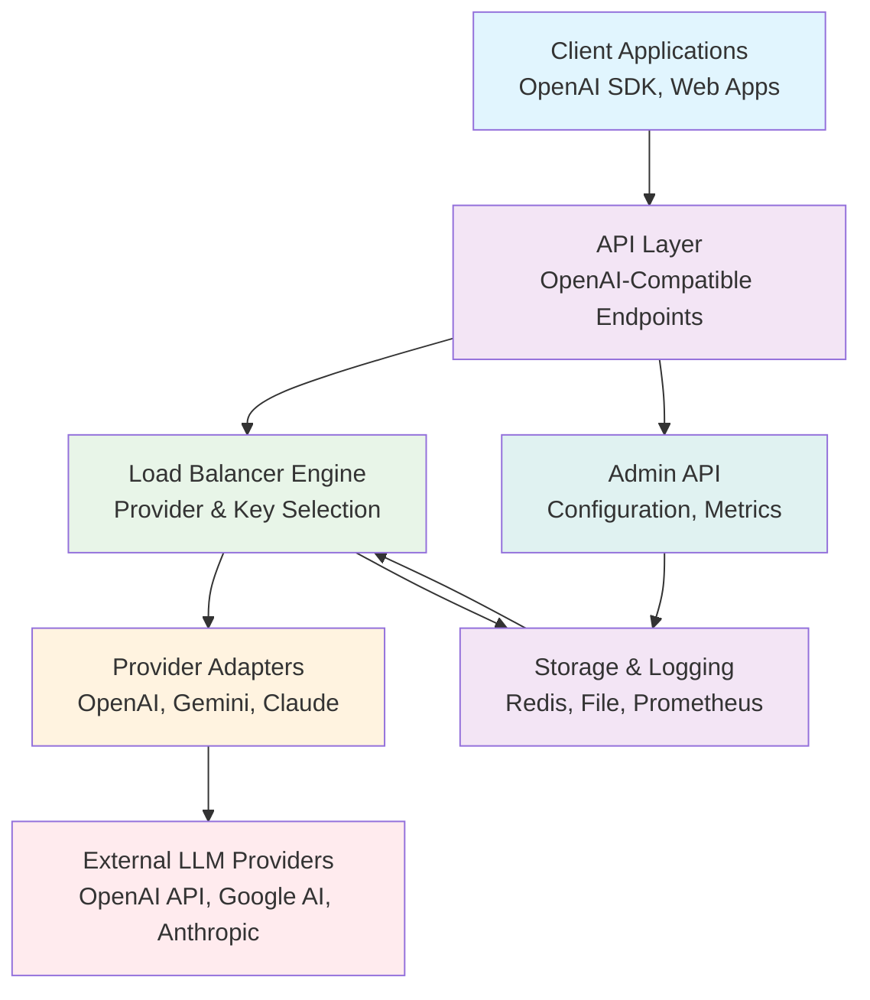

# Architecture

---
sidebar_position: 1
tags: [developer-guide, architecture]
---

This document describes the high-level architecture of TruckLLM, including component interactions and design decisions.

## System Overview

TruckLLM follows a modular, plugin-based architecture designed for extensibility and maintainability. The system is built in Go and uses a layered architecture pattern.



```
┌─────────────────────────────────────────────────────────────┐
│                    Client Applications                      │
│  (OpenAI SDK, Custom Clients, Web Apps)                     │
└─────────────────────┬───────────────────────────────────────┘
                      │
┌─────────────────────▼───────────────────────────────────────┐
│                    API Layer                                │
│  ┌─────────────────────────────────────────────────────┐    │
│  │ OpenAI-Compatible Endpoints (/v1/*)                 │    │
│  │ - /chat/completions                                  │    │
│  │ - /completions                                       │    │
│  │ - /embeddings                                        │    │
│  │ - /models                                            │    │
│  └─────────────────────────────────────────────────────┘    │
│  ┌─────────────────────────────────────────────────────┐    │
│  │ Admin API (/admin/v1/*)                             │    │
│  │ - Configuration management                          │    │
│  │ - Health checks                                      │    │
│  │ - Metrics endpoints                                  │    │
│  └─────────────────────────────────────────────────────┘    │
└─────────────────────┬───────────────────────────────────────┘
                      │
┌─────────────────────▼───────────────────────────────────────┐
│                 Load Balancer Engine                        │
│  ┌─────────────────────────────────────────────────────┐    │
│  │ Selector                                             │    │
│  │ - Provider selection                                 │    │
│  │ - Key selection                                      │    │
│  │ - Cost optimization                                  │    │
│  └─────────────────────────────────────────────────────┘    │
│  ┌─────────────────────────────────────────────────────┐    │
│  │ Metrics Collector                                   │    │
│  │ - Usage tracking                                     │    │
│  │ - Performance monitoring                             │    │
│  └─────────────────────────────────────────────────────┘    │
└─────────────────────┬───────────────────────────────────────┘
                      │
┌─────────────────────▼───────────────────────────────────────┐
│                 Provider Adapters                           │
│  ┌─────────────────────────────────────────────────────┐    │
│  │ OpenAI Adapter                                       │    │
│  │ - Request transformation                              │    │
│  │ - Response parsing                                    │    │
│  └─────────────────────────────────────────────────────┘    │
│  ┌─────────────────────────────────────────────────────┐    │
│  │ Gemini Adapter                                       │    │
│  │ - Google AI API integration                          │    │
│  └─────────────────────────────────────────────────────┘    │
│  ┌─────────────────────────────────────────────────────┐    │
│  │ Claude Adapter                                       │    │
│  │ - Anthropic API integration                          │    │
│  └─────────────────────────────────────────────────────┘    │
│  ┌─────────────────────────────────────────────────────┐    │
│  │ Custom Provider Interface                           │    │
│  │ - Extensible plugin system                          │    │
│  └─────────────────────────────────────────────────────┘    │
└─────────────────────┬───────────────────────────────────────┘
                      │
┌─────────────────────▼───────────────────────────────────────┐
│                 Storage & Logging                           │
│  ┌─────────────────────────────────────────────────────┐    │
│  │ Runtime Storage                                      │    │
│  │ - Redis (default)                                    │    │
│  │ - File-based                                         │    │
│  │ - HTTP API                                           │    │
│  └─────────────────────────────────────────────────────┘    │
│  ┌─────────────────────────────────────────────────────┐    │
│  │ Configuration Storage                               │    │
│  │ - YAML file (default)                               │    │
│  │ - HTTP API                                           │    │
│  └─────────────────────────────────────────────────────┘    │
│  ┌─────────────────────────────────────────────────────┐    │
│  │ Logging System                                       │    │
│  │ - Structured logging (Zerolog)                      │    │
│  │ - File output                                        │    │
│  │ - Prometheus metrics                                 │    │
│  │ - HTTP webhooks                                      │    │
│  └─────────────────────────────────────────────────────┘    │
└─────────────────────┬───────────────────────────────────────┘
                      │
┌─────────────────────▼───────────────────────────────────────┐
│              External LLM Providers                         │
│  ┌─────────────────────────────────────────────────────┐    │
│  │ OpenAI API                                          │    │
│  └─────────────────────────────────────────────────────┘    │
│  ┌─────────────────────────────────────────────────────┐    │
│  │ Google Gemini API                                   │    │
│  └─────────────────────────────────────────────────────┘    │
│  ┌─────────────────────────────────────────────────────┐    │
│  │ Anthropic Claude API                                │    │
│  └─────────────────────────────────────────────────────┘    │
│  ┌─────────────────────────────────────────────────────┐    │
│  │ Custom LLM APIs                                     │    │
│  └─────────────────────────────────────────────────────┘    │
└─────────────────────────────────────────────────────────────┘
```

## Core Components

### API Layer

The API layer provides OpenAI-compatible REST endpoints. It handles:

- Request validation and transformation
- Authentication and authorization
- Response formatting
- Error handling and retries

**Key Files:**
- `internal/api/chat_completions.go`
- `internal/api/models.go`
- `internal/api/admin.go`

### Load Balancer Engine

The core intelligence of TruckLLM. Responsible for:

- Selecting optimal provider and API key combinations
- Tracking usage metrics and performance
- Implementing load balancing strategies
- Cost optimization algorithms

**Key Files:**
- `internal/balancer/selector.go`
- `internal/balancer/metrics.go`
- `internal/balancer/policy.go`

### Provider Adapters

Abstraction layer for different LLM providers. Each adapter:

- Transforms requests to provider-specific format
- Handles authentication
- Parses responses
- Extracts usage information

**Key Files:**
- `internal/provider/interface.go`
- `internal/provider/openai.go`
- `internal/provider/gemini.go`
- `internal/provider/claude.go`
- `internal/provider/registry.go`

### Storage System

Handles persistent and runtime data:

- **Runtime Storage**: Usage metrics, request counts, performance data
- **Configuration Storage**: Dynamic configuration loading
- **Extensible**: Support for Redis, File, and HTTP backends

**Key Files:**
- `internal/store/interface.go`
- `internal/store/redis.go`
- `internal/store/file.go`
- `internal/store/http.go`

### Logging System

Comprehensive observability:

- Structured logging with context
- Multiple output formats
- Integration with monitoring systems
- Extensible webhook system

**Key Files:**
- `internal/log/logger.go`
- `internal/log/prometheus.go`

## Design Principles

### Modularity
Each component has clear interfaces and responsibilities. Components can be replaced or extended without affecting others.

### Extensibility
Plugin-based architecture allows adding new providers, storage backends, and logging systems via interfaces.

### Performance
Built with Go's concurrency model. Minimal overhead in request routing. Efficient data structures for metrics tracking.

### Reliability
Comprehensive error handling, retries, and fallback mechanisms. Health checks and monitoring.

### Observability
Rich metrics, structured logging, and admin APIs for debugging and monitoring.

## Data Flow

1. **Request Reception**: API layer receives OpenAI-compatible request
2. **Authentication**: Validate API key and permissions
3. **Model Resolution**: Map model alias to provider:model
4. **Provider Selection**: Load balancer selects optimal provider
5. **Key Selection**: Choose best API key based on strategy
6. **Request Execution**: Provider adapter makes external API call
7. **Response Processing**: Parse response, extract metrics
8. **Usage Tracking**: Update storage with request metrics
9. **Logging**: Record request details
10. **Response**: Return formatted response to client

## Configuration

Configuration is centralized in YAML format with support for:

- Environment variable substitution
- Hot-reload capabilities
- Validation and defaults
- Hierarchical overrides

See [Configuration](../Guides/Configuration.md) for details.

## Security Considerations

- API key encryption at rest
- Request rate limiting
- Input validation and sanitization
- Secure communication with external providers
- Audit logging for compliance